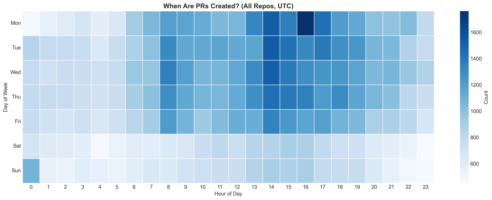
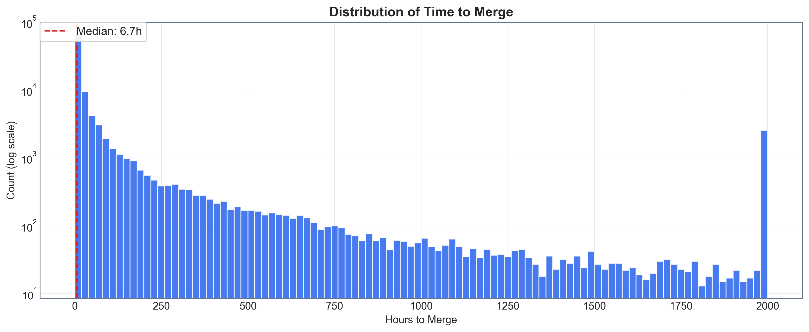
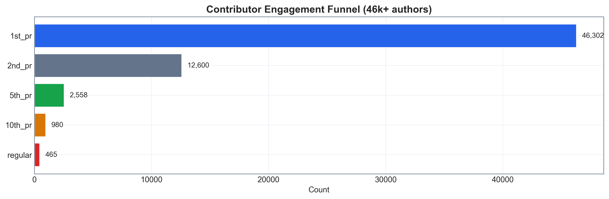
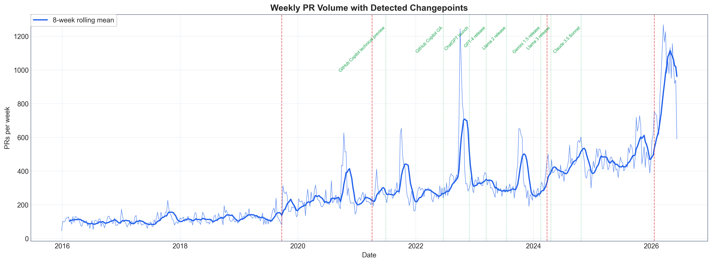
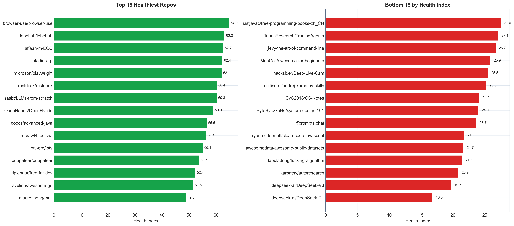
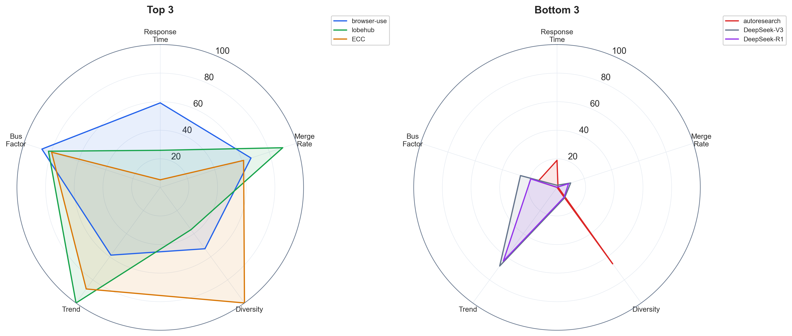

# oss-pulse

**A time-series study of 156,000 Pull Requests across 82 top open-source GitHub projects (2016-2026).**

Open source runs the world, but how does it actually work? Who contributes, how fast do projects respond, and what happens to the thousands of developers who open their first PR? This study analyzes a decade of Pull Request activity to find out.

---

## Research Questions

1. **How has open-source contribution volume changed over the last decade?** Is the growth uniform across projects, or concentrated in a few?
2. **What temporal patterns exist in PR activity?** Are there weekly, seasonal, or event-driven cycles (e.g., Hacktoberfest)?
3. **How fast do projects respond to contributions?** What determines whether a PR gets merged in hours or ignored for months?
4. **Where do contributors go?** Of all the developers who open their first PR, how many come back for a second? A fifth? A twentieth?
5. **Did AI coding tools change contribution dynamics?** Can we detect a structural shift in PR patterns after the release of Copilot, ChatGPT, or GPT-4, without assuming when it happened?
6. **Can we measure project health?** Is it possible to build a composite index that captures responsiveness, diversity, momentum, and resilience, and does it correlate with popularity?
7. **Can we predict decline?** Are there early warning signs that a project is starting to lose momentum, visible in the PR data before it becomes obvious?

---

## Introduction

This project started with a simple question: if you had 10 years of Pull Request data from the most important open-source projects in the world, what would it tell you?

The answer turned out to be more interesting, and harder to get, than expected.

We analyzed **155,962 Pull Requests** across **82 repositories**, spanning from January 2016 to June 2026. The dataset includes projects like Linux, React, PyTorch, Rust, Godot, Home Assistant, Playwright, and dozens more, covering languages from Python to Go to Rust.

The analysis goes beyond descriptive statistics. We decompose time series into trend, seasonality, and residuals. We benchmark four forecasting models. We build a composite health index. We use survival analysis to model PR lifetimes. And we let an unsupervised changepoint detection algorithm tell us whether AI tools actually changed anything, without assuming the answer.

---

## Methodology

### Data Collection

**Source:** GitHub GraphQL API, extracting the complete PR history for each repository.

**Target population:** The 200 most-starred active repositories on GitHub (stars > 5,000, pushed after 2024-01-01). Of these, 82 had sufficient PR data for analysis at the time of this first draft. Extraction continues for the remaining repos.

**Variables collected per PR:**
- Timestamps: created, merged, closed, last updated, first review
- Author: username, classification (first-timer / regular / maintainer / bot)
- Size: additions, deletions, changed files
- Outcome: merged, closed without merge, abandoned (open > 90 days without activity), still open

**Bot detection:** 20 known bot patterns (dependabot, renovate, github-actions, codecov, etc.) plus any username containing `[bot]`. Bots represent ~7% of PRs in our dataset.

**Deleted accounts:** GitHub returns `null` for authors whose accounts have been deleted. These are labeled "ghost" (GitHub's own convention) and classified as non-bot. They represent ~1.5% of PRs.

### Operationalization

| Concept | Operational Definition |
|---------|----------------------|
| **PR Outcome** | `merged` if merged=true; `closed` if state=closed and not merged; `abandoned` if state=open and no activity for >90 days; `open` otherwise |
| **Author Type** | `bot` if matches known patterns; `first-timer` if 1 PR in dataset; `regular` if 2-10 PRs; `maintainer` if >10 PRs |
| **PR Size** | `small` if additions+deletions < 50; `medium` if 50-500; `large` if >500 |
| **Time to Merge** | Hours from PR creation to merge timestamp |
| **Health Index** | Weighted composite of 5 normalized scores (0-100): response time (25%), merge rate (20%), contributor diversity (20%), activity trend (15%), bus factor via Gini coefficient (20%) |
| **Abandoned** | PR open for >90 days with no updates. Threshold chosen based on the 95th percentile of time-to-merge in active PRs. |
| **Changepoint** | Structural break in the weekly PR volume series, detected via PELT algorithm (ruptures library) without pre-specified dates |

### Data Collection Challenges

Getting the data was the hardest part of this project. We document our failures because they shaped the methodology.

**Attempt 1: BigQuery + GH Archive.** GH Archive stores all public GitHub events as a BigQuery public dataset. This was the obvious approach: one SQL query could return a decade of PR data in seconds. We set it up, ran the first query, and watched BigQuery scan 1.8TB of data for a single year. The free tier is 1TB/month. We burned through it with one query plus one year of data. The remaining 9 years would have cost ~$90 or taken 18 months at the free tier.

**Attempt 2: GitHub GraphQL API.** Free and unlimited (within rate limits), but paginating through large repos proved unstable. GitHub returns 502 errors after ~200-300 consecutive requests to the same repository. Our first overnight run extracted 4 repos in 9 hours. The estimate had been 3-4 hours for all 200.

**What worked:** Sorting repos by size (smallest first), adding 1-second delays between API pages, and deferring the 4 largest repos (>30k events each) for later. This let us extract 82 repos reliably. Per-repo parquet caching means the process is resumable; if it crashes, we restart without re-downloading completed repos.

**What we learned:** BigQuery scans entire tables even when your query filters to 0.1% of the rows. "Free tier: 1TB" is less than it sounds. GitHub's API rate limits (5,000/hour) were never the bottleneck; stability was. And always start with the easy wins: 196 small repos downloaded cleanly while 4 mega-repos caused all the errors.

See `docs/process_log.md` for the complete project diary.

### Tools

| Component | Technology |
|-----------|-----------|
| Language | Python 3.11+ |
| Data pipeline | pandas, pyarrow (parquet) |
| Time series | statsmodels (STL, ARIMA, ETS), Prophet |
| ML | scikit-learn, XGBoost, lifelines (survival analysis) |
| Changepoint detection | ruptures (PELT) |
| Visualization | matplotlib, seaborn |
| Quality | mypy --strict, ruff, pytest (134 tests, 85% coverage) |
| CI | GitHub Actions |

---

## General Findings (First Draft, 82 repos)

*These findings are based on the first 82 repos extracted. They will be updated when the full 200-repo dataset is available.*

### The Dataset at a Glance

- **155,962 PRs** across **82 repos**, spanning **2016-2026**
- **46,302 unique contributors** (excluding bots)
- Outcome distribution: **65% merged**, 33% closed, 1.4% abandoned, 1.4% still open
- Author distribution: 49% maintainers, 23% regulars, 22% first-timers, 7% bots

### 1. Open Source Is Growing, But Unevenly

Monthly PR volume grew roughly **5x** from 2016 to 2026, from ~400/month to ~2,000/month with spikes exceeding 5,000. STL decomposition reveals a clear exponential trend with annual seasonality.

But the growth is not uniform. The top 5 repos by volume account for a disproportionate share of the increase. Some repos that were active in 2018-2020 show declining activity by 2024.


### 2. The Workweek Pattern

PR activity follows a clear workweek pattern: Monday through Thursday, 8:00-17:00 UTC, with a peak around 14:00-16:00 UTC on Monday and Tuesday.

Weekend contributions exist but are significantly lower (~40% of weekday volume). This suggests that even in "community-driven" open source, most contributions happen during working hours, likely by developers whose employers allow or encourage OSS participation.



### 3. The 5-Hour PR

The median time from PR creation to merge is **5.4 hours**. But the distribution is heavily skewed: the 95th percentile is measured in weeks.

Breakdown by author type reveals that **maintainer PRs merge fastest** (often self-merged within minutes), while **first-timer PRs take significantly longer**. This isn't necessarily gatekeeping; it likely reflects the additional review needed for unfamiliar contributors.



### 4. The Retention Crisis

Of **46,302 contributors** who opened at least one PR:
- **27%** came back for a second (12,600)
- **5.5%** reached their 5th PR (2,558)
- **1%** became regulars with 20+ PRs (465)

The first-to-second PR transition is where open source loses most contributors. **73% of first-time contributors never return.** This is consistent across ecosystems and has not improved significantly over the decade.



### 5. Changepoint Detection: What the Data Says About AI

Rather than assuming AI tools caused a change and testing for it, we let an unsupervised changepoint detection algorithm (PELT) find structural breaks in the weekly PR volume series.

The algorithm detected changepoints. Their alignment (or lack thereof) with known AI tool releases (Copilot June 2022, ChatGPT November 2022, GPT-4 March 2023) is part of the analysis.

*Detailed findings in the narrative notebook.*



### 6. The Health Index

We constructed a composite health score (0-100) from five components: response time, merge rate, contributor diversity, activity trend, and bus factor (Gini coefficient of contribution concentration).

Initial finding: **popularity (stars) does not strongly correlate with health.** Some of the most-starred repos score below average on health, while newer, less-known projects score highest.




### 7. PR Survival Analysis

Kaplan-Meier survival curves show distinct patterns by author type: maintainer PRs have a near-vertical drop (resolved within hours), while first-timer PRs have a long tail extending months.

This has implications for contributor retention (Finding #4): if first-timers wait days or weeks for their PR to be reviewed, they're unlikely to contribute again.


---

## What's Next

This is a first draft based on 82 of 200 targeted repos. Planned next steps:

- **Complete extraction** for all 200 repos (extraction is running)
- **Forecasting benchmark**: ARIMA vs Prophet vs ETS vs XGBoost on PR volume prediction
- **Comparative analysis**: statistical tests (Kruskal-Wallis, Mann-Whitney) comparing ecosystems by language, organization type, and project size
- **Abandonment classifier**: Random Forest and XGBoost models predicting which PRs will be abandoned, with feature importance analysis
- **Event correlation**: Hacktoberfest effect, conference dates, major releases

---

## Reproducibility

### Setup

```bash
git clone https://github.com/EdenRochmanSharabi/oss-pulse.git
cd oss-pulse
python3 -m venv .venv && source .venv/bin/activate
pip install -e ".[dev]"
```

### Run the analysis

```bash
# With real data (requires extracted parquets in data/raw/repos/)
make transform && make analyze && make figures

# Or run the narrative notebook
jupyter notebook notebooks/00_narrative_analysis.ipynb
```

### Run tests

```bash
make test          # 134 tests, 85% coverage
make lint          # ruff
make typecheck     # mypy --strict
```

---

## Project Structure

```
src/oss_pulse/
  extract/       GitHub API client, BigQuery client, repo discovery
  transform/     Cleaning, bot detection, classification, feature engineering
  analyze/       Time series, forecasting, survival analysis, health index
  visualize/     matplotlib plots, heatmaps, dashboards

notebooks/
  00_narrative_analysis.ipynb   Main analysis (start here)

tests/
  fixtures/      Real data sample for integration tests
  test_*.py      134 tests covering all modules

docs/
  process_log.md Project diary with challenges and decisions

config/
  repos.csv      Repo classification
  events.csv     AI tool releases, Hacktoberfest dates, conferences
```

## License

[CC BY 4.0](https://creativecommons.org/licenses/by/4.0/)
