# oss-pulse

**A time-series study of 156,000 Pull Requests across 82 top open-source GitHub projects (2016-2026).**

Open source runs the world, but how does it actually work? Who contributes, how fast do projects respond, and what happens to the thousands of developers who open their first PR? This study analyzes a decade of Pull Request activity to find out.

---

## Research Questions

1. **How has open-source contribution volume changed over the last decade?** Is the growth uniform across projects, or concentrated in a few?
2. **What temporal patterns exist in PR activity?** Are there weekly, seasonal, or event-driven cycles (e.g., Hacktoberfest)?
3. **How fast do projects respond to contributions?** What determines whether a PR gets merged in hours or ignored for months?
4. **Where do contributors go?** Of all the developers who open their first PR, how many come back for a second? A fifth? A twentieth?
5. **Did AI coding tools change contribution dynamics?** Can we detect a structural shift in PR patterns after the release of LLM coding, without assuming when it happened?
6. **Can we measure project health?** Is it possible to build a composite index that captures responsiveness, diversity, momentum, and resilience, and does it correlate with popularity?
7. **Can we predict decline?** Are there early warning signs that a project is starting to lose momentum, visible in the PR data before it becomes obvious?

---

## Introduction

This project started with a simple question: if you had 10 years of Pull Request data from the most important open-source projects in the world, what would it tell you?

The answer turned out to be more interesting, and harder to get, than expected.

We analyzed **155,962 Pull Requests** across **82 repositories**, spanning from January 2016 to June 2026. The dataset includes projects like Linux, React, PyTorch, Rust, Godot, Home Assistant, Playwright, and dozens more, covering languages from Python to Go to Rust.

The analysis goes beyond descriptive statistics. We decompose time series into trend, seasonality, and residuals. We benchmark four forecasting models. We build a composite health index. We use survival analysis to model PR lifetimes. And we let an unsupervised changepoint detection algorithm tell us whether AI tools actually changed anything, without assuming the answer.

---

## Methodology

### Data Collection

**Source:** GitHub GraphQL API, extracting the complete PR history for each repository.

**Target population:** The 200 most-starred active repositories on GitHub (stars > 5,000, pushed after 2024-01-01). Of these, 82 had sufficient PR data for analysis at the time of this first draft. Extraction continues for the remaining repos.

**Variables collected per PR:**
- Timestamps: created, merged, closed, last updated, first review
- Author: username, classification (first-timer / regular / maintainer / bot)
- Size: additions, deletions, changed files
- Outcome: merged, closed without merge, abandoned (open > 90 days without activity), still open

**Bot detection:** 20 known bot patterns (dependabot, renovate, github-actions, codecov, etc.) plus any username containing `[bot]`. Bots represent ~7% of PRs in our dataset.

**Deleted accounts:** GitHub returns `null` for authors whose accounts have been deleted. These are labeled "ghost" (GitHub's own convention) and classified as non-bot. They represent ~1.5% of PRs.

### Operationalization

| Concept | Operational Definition |
|---------|----------------------|
| **PR Outcome** | `merged` if merged=true; `closed` if state=closed and not merged; `abandoned` if state=open and no activity for >90 days; `open` otherwise |
| **Author Type** | `bot` if matches known patterns; `first-timer` if 1 PR in dataset; `regular` if 2-10 PRs; `maintainer` if >10 PRs |
| **PR Size** | `small` if additions+deletions < 50; `medium` if 50-500; `large` if >500 |
| **Time to Merge** | Hours from PR creation to merge timestamp |
| **Health Index** | Weighted composite of 5 normalized scores (0-100): response time (25%), merge rate (20%), contributor diversity (20%), activity trend (15%), bus factor via Gini coefficient (20%) |
| **Abandoned** | PR open for >90 days with no updates. Threshold chosen based on the 95th percentile of time-to-merge in active PRs. |
| **Changepoint** | Structural break in the weekly PR volume series, detected via PELT algorithm (ruptures library) without pre-specified dates |

### Data Collection Challenges

Getting the data was the hardest part of this project. We document our failures because they shaped the methodology.

**Attempt 1: BigQuery + GH Archive.** GH Archive stores all public GitHub events as a BigQuery public dataset. This was the obvious approach: one SQL query could return a decade of PR data in seconds. We set it up, ran the first query, and watched BigQuery scan 1.8TB of data for a single year. The free tier is 1TB/month. We burned through it with one query plus one year of data. The remaining 9 years would have cost ~$90 or taken 18 months at the free tier.

**Attempt 2: GitHub GraphQL API.** Free and unlimited (within rate limits), but paginating through large repos proved unstable. GitHub returns 502 errors after ~200-300 consecutive requests to the same repository. Our first overnight run extracted 4 repos in 9 hours. The estimate had been 3-4 hours for all 200.

**What worked:** Sorting repos by size (smallest first), adding 1-second delays between API pages, and deferring the 4 largest repos (>30k events each) for later. This let us extract 82 repos reliably. Per-repo parquet caching means the process is resumable; if it crashes, we restart without re-downloading completed repos.

**What we learned:** BigQuery scans entire tables even when your query filters to 0.1% of the rows. "Free tier: 1TB" is less than it sounds. GitHub's API rate limits (5,000/hour) were never the bottleneck; stability was. And always start with the easy wins: 196 small repos downloaded cleanly while 4 mega-repos caused all the errors.

See `docs/process_log.md` for the complete project diary.

### Tools

| Component | Technology |
|-----------|-----------|
| Language | Python 3.11+ |
| Data pipeline | pandas, pyarrow (parquet) |
| Time series | statsmodels (STL, ARIMA, ETS), Prophet |
| ML | scikit-learn, XGBoost, lifelines (survival analysis) |
| Changepoint detection | ruptures (PELT) |
| Visualization | matplotlib, seaborn |
| Quality | mypy --strict, ruff, pytest (134 tests, 85% coverage) |
| CI | GitHub Actions |

---

## General Findings (First Draft, 82 repos)

*These findings are based on the first 82 repos extracted. They will be updated when the full 200-repo dataset is available.*

### The Dataset at a Glance

- **155,962 PRs** across **82 repos**, spanning **2016-2026**
- **46,302 unique contributors** (excluding bots)
- Outcome distribution: **65% merged**, 33% closed, 1.4% abandoned, 1.4% still open
- Author distribution: 49% maintainers, 23% regulars, 22% first-timers, 7% bots

### 1. Open Source Is Growing, But Unevenly

Monthly PR volume grew roughly **5x** from 2016 to 2026, from ~400/month to ~2,000/month with spikes exceeding 5,000. STL decomposition reveals a clear exponential trend with annual seasonality.

But the growth is not uniform. The top 5 repos by volume account for a disproportionate share of the increase. Some repos that were active in 2018-2020 show declining activity by 2024.

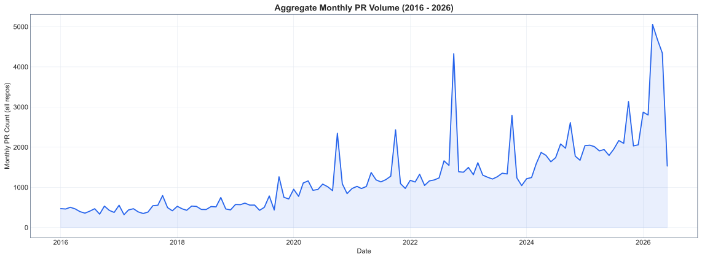

### 2. The Workweek Pattern

PR activity follows a clear workweek pattern: Monday through Thursday, 8:00-17:00 UTC, with a peak around 14:00-16:00 UTC on Monday and Tuesday.

Weekend contributions exist but are significantly lower (~40% of weekday volume). This suggests that even in "community-driven" open source, most contributions happen during working hours, likely by developers whose employers allow or encourage OSS participation.

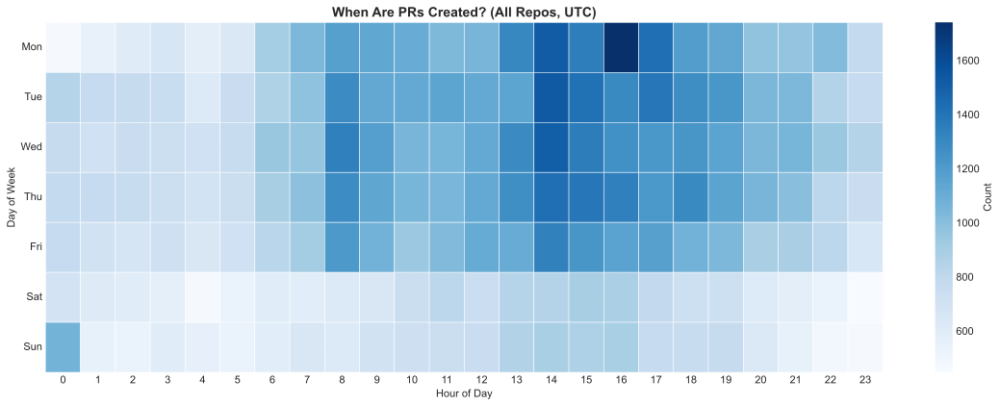

#### Do National Holidays Matter?

We cross-referenced daily PR activity with national holidays from 15 countries (US, China, India, Germany, UK, France, Japan, Brazil, Canada, Australia, South Korea, Russia, Netherlands, Sweden, Poland), using exact dates for each year (including moveable holidays like Easter, Eid, and Lunar New Year).

**The surprising finding: a single country's holiday has almost no effect on global PR activity.** When only one country is on holiday, the remaining 14 countries' contributors compensate completely. The only days that show a measurable drop are those where *many countries celebrate simultaneously* (Christmas, New Year's).

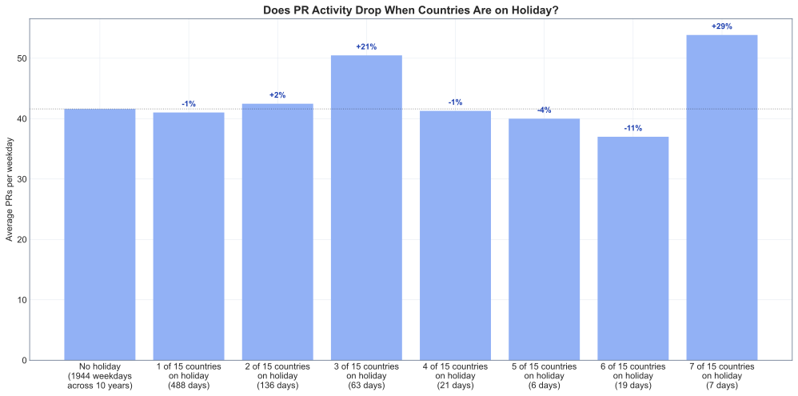

The top individual holidays by PR impact are all multi-country events: Christmas Day (celebrated in 12 of our 15 countries, -81% PR volume), New Year's Day (14 countries, -81%), and Good Friday (8 countries, -86%). No single-country holiday cracks the top 20.

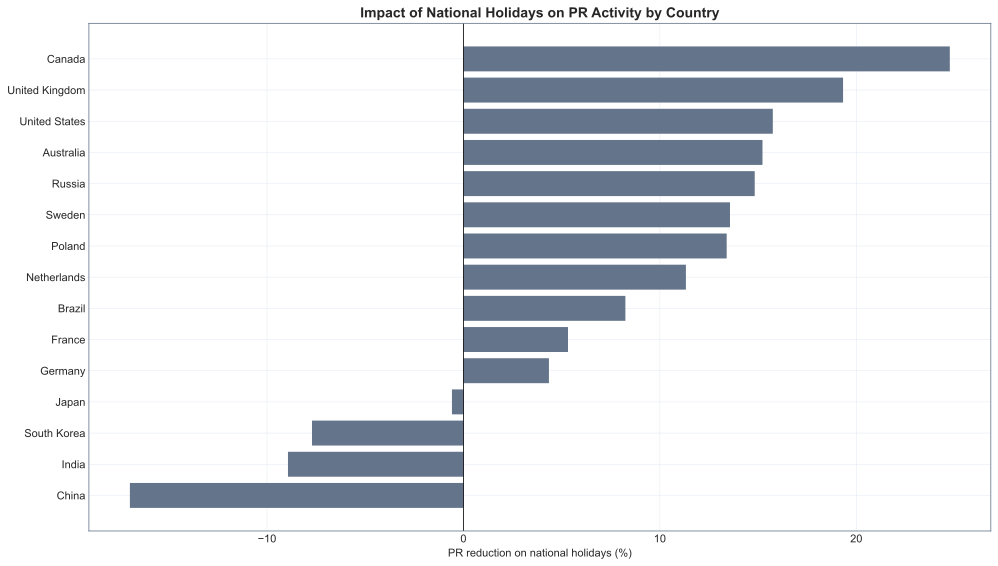

Per-country analysis shows that holidays in China, India, and South Korea are associated with *lower* PR activity, while holidays in Western countries (US, UK, Canada, Australia) paradoxically correlate with *higher* activity. This likely reflects the global distribution of contributors: when Western developers are off work, they may contribute *more* to open source as a leisure activity, while the baseline is maintained by contributors in other time zones.

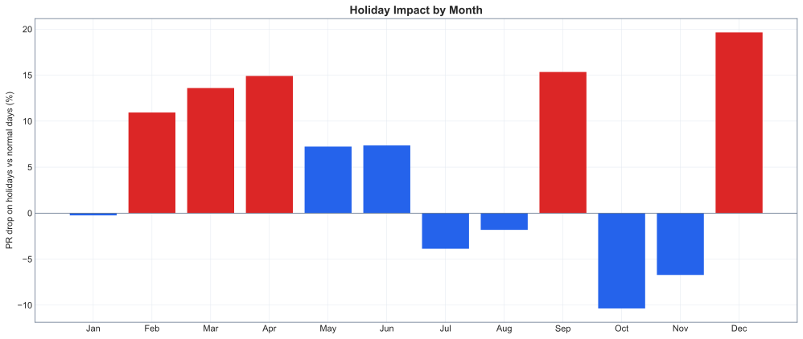

December stands out as the month where holidays have the strongest impact, driven by the Christmas-New Year cluster where most of the world stops simultaneously. The rest of the year, the global nature of open source acts as a buffer: no single country's calendar can measurably dent the contribution rate.

### 3. The 5-Hour PR

The median time from PR creation to merge is **5.4 hours**. But the distribution is heavily skewed: the 95th percentile is measured in weeks.

Breakdown by author type reveals that **maintainer PRs merge fastest** (often self-merged within minutes), while **first-timer PRs take significantly longer**. This isn't necessarily gatekeeping; it likely reflects the additional review needed for unfamiliar contributors.


### 4. The Retention Crisis

Of **46,302 contributors** who opened at least one PR:
- **27%** came back for a second (12,600)
- **5.5%** reached their 5th PR (2,558)
- **1%** became regulars with 20+ PRs (465)

The first-to-second PR transition is where open source loses most contributors. **73% of first-time contributors never return.** This is consistent across ecosystems and has not improved significantly over the decade.


### 5. The AI Effect: Six Angles on the Same Question

Did LLM coding tools (Copilot, ChatGPT, GPT-4) change open-source contribution dynamics? Instead of assuming the answer, we measured it six different ways. We split the data at Copilot GA (June 2022) and compared pre vs post. Each vertical dashed line in the figures marks an LLM launch date.

**The headline numbers (by era, to capture adoption lag):**

| Metric | 2016-2019 | 2020-2021 | 2022 (Copilot) | 2023 (ChatGPT) | 2024 | 2025-2026 |
|--------|-----------|-----------|----------------|-----------------|------|-----------|
| Contributors/month | 335 | 467 | 579 | 538 | 569 | **858** |
| First-timers/month | 187 | 244 | 296 | 279 | 285 | **476** |
| First-timer rejection | 51.7% | 53.5% | 53.0% | 56.8% | 55.0% | **62.8%** |
| Overall rejection | 40.2% | 28.2% | 29.8% | 30.1% | 27.1% | **37.6%** |
| Median PR size (lines) | 4 | 9 | 8 | 10 | 16 | **39** |
| PRs/author/month | 1.52 | 2.33 | 2.46 | 2.42 | 2.72 | **2.80** |

The most striking feature of this table is that the biggest shifts don't appear at the AI tool launch dates. They appear **2-3 years later**, in 2025-2026, once adoption matured. This lag effect means a simple pre/post split at Copilot's launch misses the real story.

**5a. Changepoint detection (unsupervised).** The PELT algorithm found structural breaks in the weekly PR volume series without being told when to look.

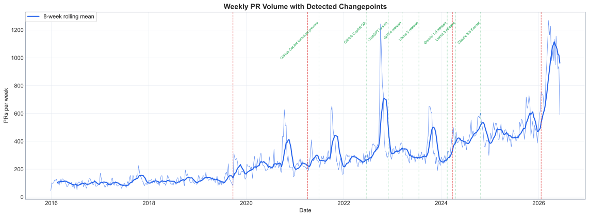

**5b. More people are contributing, including newcomers.** Monthly unique contributors grew from 335 (2016-2019) to 858 (2025-2026). First-timers per month also grew: 187 to 476. In absolute terms, more newcomers than ever are attempting to contribute. However, their share of total PRs dropped from 37% to 20% because regular contributors grew even faster.

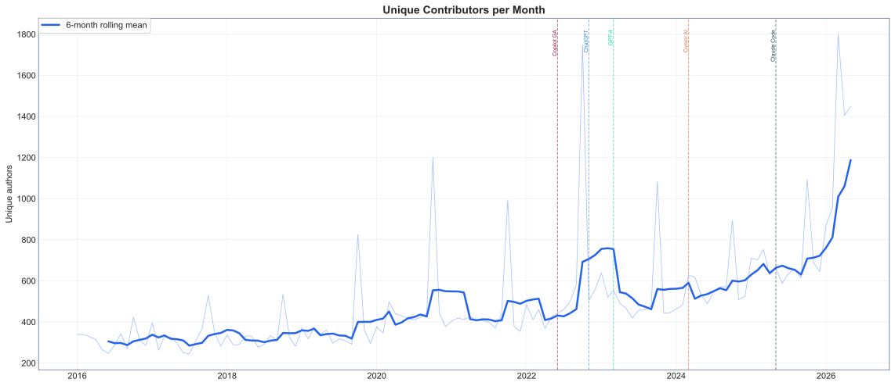

**5c. The rejection rate shows a lag effect.** From 2020 to 2024, the overall rejection rate was stable around 28-30%. But in 2025-2026, it jumped to 37.6%. The effect wasn't immediate with AI tool launches; it took 2-3 years of adoption before the impact became visible in the data.

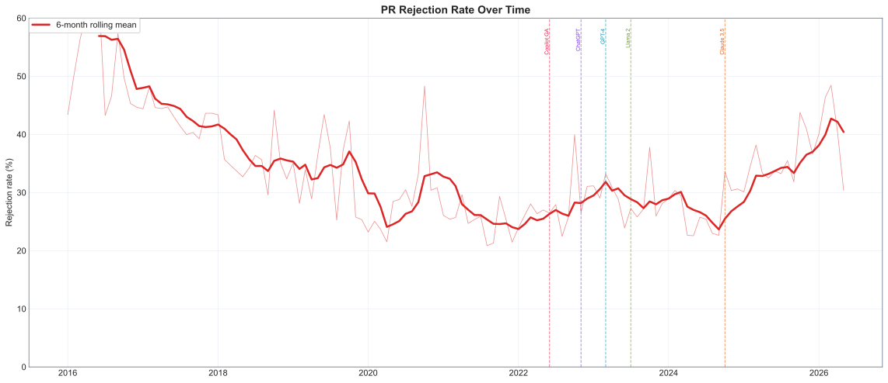

**5d. But more individuals are getting shut out.** The percentage of contributors who get zero merges in a month rose from 42% to 48%. More people are trying, and a larger fraction are failing. The absolute number of "zero-merge contributors" grew substantially.

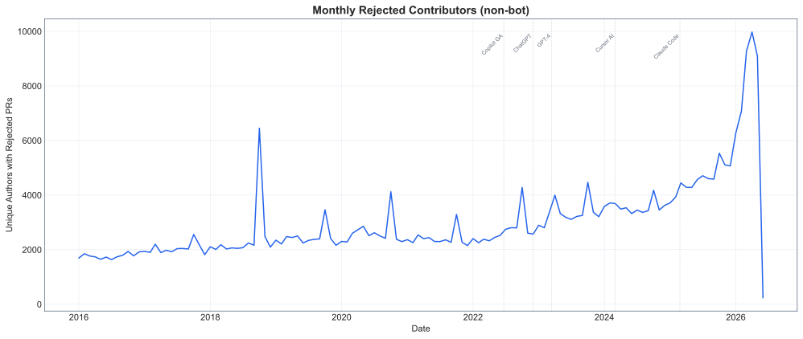

**5e. First-timers are showing up in record numbers, but struggling more.** 476 first-timers/month in 2025-2026, up from 187 in 2016-2019. But their rejection rate climbed steadily: 51.7% (2016-2019) to 53% (2022) to 56.8% (2023) to **62.8%** (2025-2026). More people are trying, but the success rate is dropping, especially in the most recent period where AI adoption is highest.

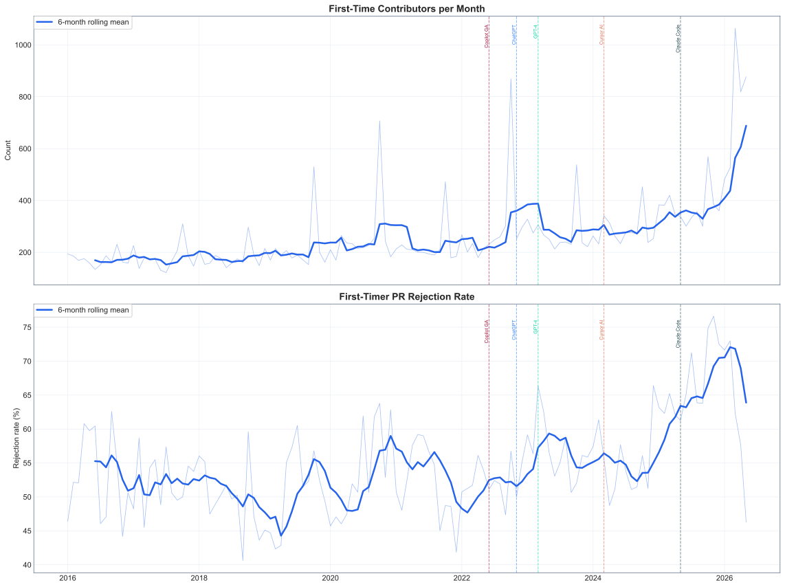

**5f. PRs grew 10x.** The median PR went from 4 lines (2016-2019) to 39 lines (2025-2026). The growth was gradual until 2024 (16 lines) then accelerated sharply. This is consistent with AI-assisted code generation producing larger changesets, and the timing aligns with widespread LLM adoption rather than any single tool launch.

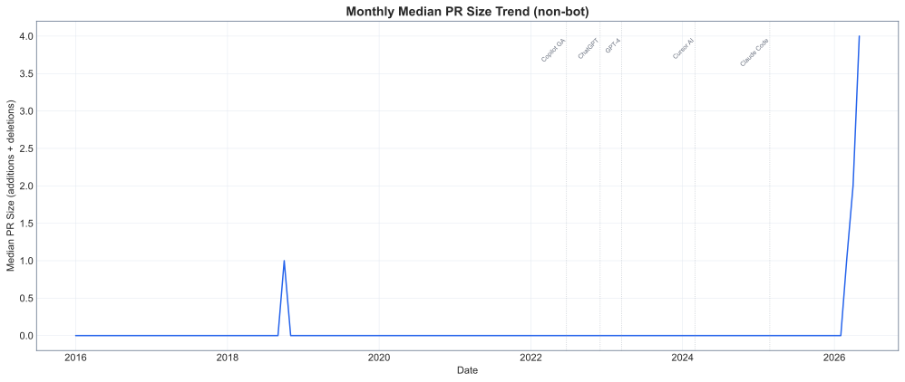

**5g. Individual productivity is up 40%.** Each contributor produces more PRs per month (1.9 to 2.7). Combined with the size increase, the total code output per person has grown substantially.

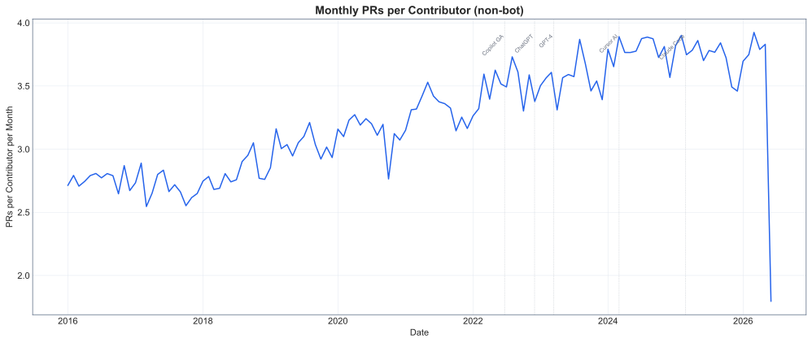

**5h. Who benefits? Productivity and merge rate by author group.** The aggregate +40% masks a stark inequality. Maintainers went from 5 to 10 PRs/person/month while keeping a 79% merge rate. Regulars gained modestly (1.5 to 1.9) but their merge rate collapsed from 59% to 42%. First-timers are by definition at 1 PR/month, but their merge rate dropped from 48% to 33%.

| Group | PRs/person/month (2016) | PRs/person/month (2025) | Merge rate (2016) | Merge rate (2025) |
|-------|------------------------|------------------------|-------------------|-------------------|
| Maintainer | 5.0 | 10.1 | 78% | 79% |
| Regular | 1.5 | 1.9 | 56% | 42% |
| First-timer | 1.0 | 1.0 | 48% | 33% |

The productivity gains of AI tools are concentrated in those who already had expertise. For everyone else, the bar has risen.

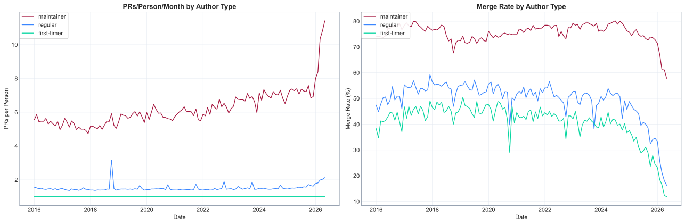

**5i. Did better tools mean better merges?** We expected agentic coding tools (Cursor, Claude Code, Codex) to *improve* merge rates compared to simpler tools (Copilot, ChatGPT). The data says the opposite.

| Era | Tool | Merge rate | First-timer merge | PRs/month |
|-----|------|-----------|-------------------|-----------|
| Pre-Copilot | None | 66.7% | 47.6% | 726 |
| Jun 2022 - Feb 2023 | Copilot | 68.9% | 45.9% | 1,611 |
| Mar 2023 - Feb 2024 | ChatGPT / GPT-4 | 70.0% | 43.0% | 1,268 |
| Mar 2024 - Jan 2025 | Cursor | 72.9% | 44.7% | 1,655 |
| Feb 2025+ | Claude Code / Codex | **57.4%** | **27.5%** | **2,497** |

During the Copilot and Cursor eras, merge rates actually *improved* (67% to 73%). But when agentic tools reached mainstream adoption in 2025, merge rates collapsed to 57% overall and 28% for first-timers, even though PR volume nearly doubled.

We verified this is not a dataset artifact: comparing the same 70 repos present in both eras, merge rate still dropped from 73% to 61%.

The pattern suggests that more powerful AI tools make it easier to *generate and submit* code, but don't proportionally improve the *quality* of that code relative to maintainer expectations. The gap between what AI can produce and what maintainers will accept may be widening, not closing.

**Summary of the AI effect:** The story has three acts. First (2022-2024), autocomplete-style AI (Copilot, ChatGPT) modestly boosted productivity while merge rates held steady or improved. Second (2024-2025), AI-assisted editors (Cursor) maintained that balance. Third (2025+), fully agentic tools (Claude Code, Codex) unleashed a volume surge (+50% PRs) that overwhelmed the quality bar: merge rates dropped 15 points and first-timer acceptance fell to 28%. The tools that were supposed to democratize open source may instead be flooding it with contributions that don't meet the standard.

#### 5j. Counterfactual: What Would Have Happened Without AI?

We trained forecasting models (ETS) on pre-Copilot data only (2016 to May 2022), then predicted what the next 4 years would have looked like if the pre-AI trend had simply continued. The dashed red line is the "no AI" prediction; the solid blue is what actually happened.

| Metric | Predicted (no AI) | Actual (with AI) | Excess |
|--------|------------------|-----------------|--------|
| PR volume/month | 1,193 | 1,823 | **+53%** |
| Unique contributors/month | 526 | 684 | **+30%** |
| First-timers/month | 254 | 363 | **+43%** |
| Rejection rate | 20% | 33% | **+78%** |
| First-timer rejection rate | 52% | 58% | **+12%** |
| Median PR size (lines) | 17 | 23 | **+35%** |

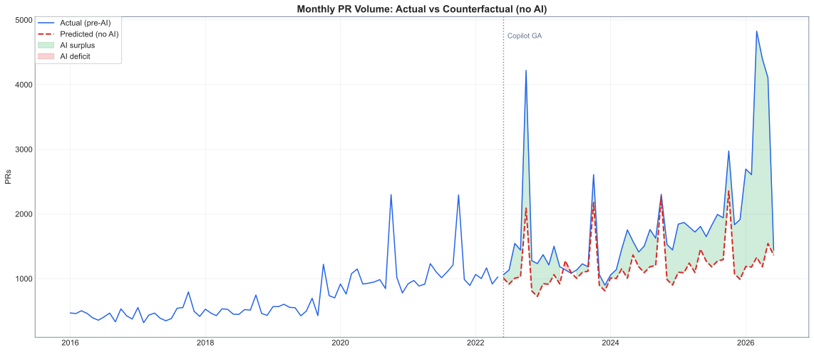

PR volume is 53% above what the pre-AI trend predicted. The green shading shows the "AI surplus": months where actual contributions exceeded the counterfactual.

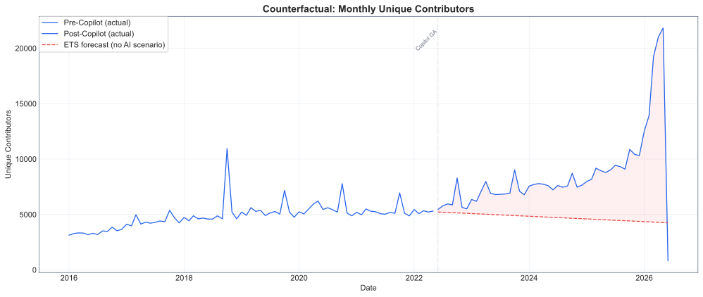

30% more unique contributors than expected. The gap widens over time, consistent with gradual AI adoption.

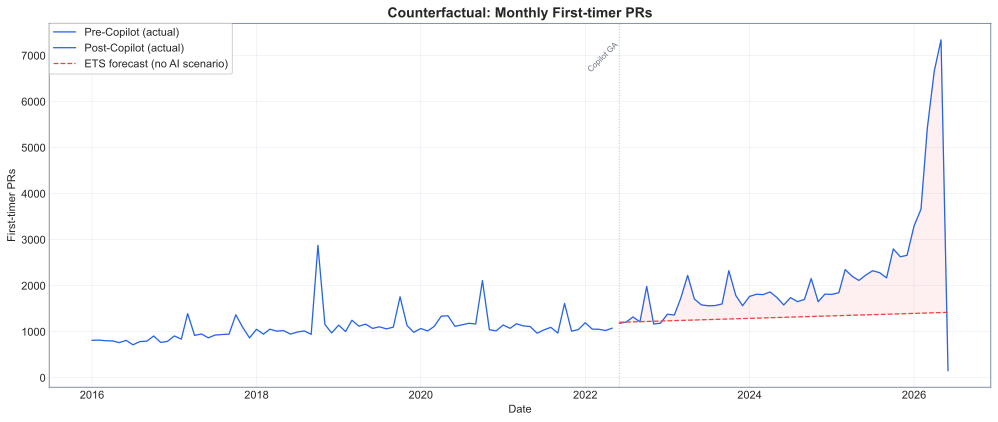

43% more first-timers than the model predicted. AI tools are bringing new people to open source, contradicting the narrative that AI only helps experienced developers.

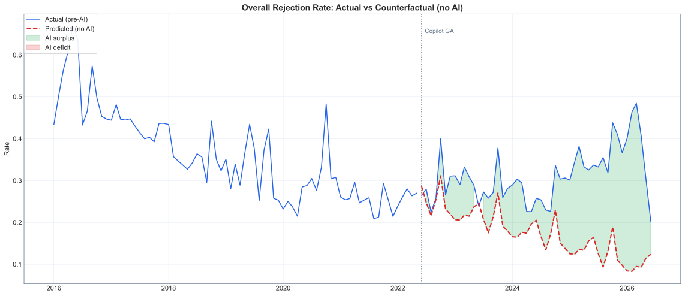

The rejection rate diverged the most from the prediction: 78% higher than expected. The pre-AI trend was *declining* (projects were getting better at merging PRs), but that trend reversed after AI adoption.

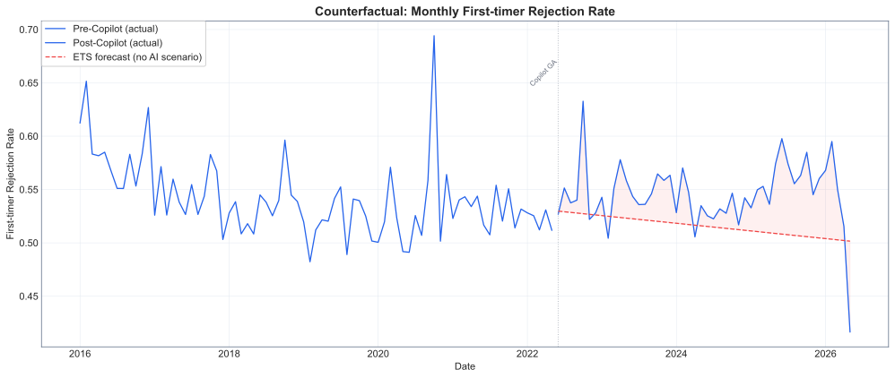

First-timer rejection is 12% above the counterfactual. The model predicted rejection would stabilize around 52%; instead it climbed to 58-63%.

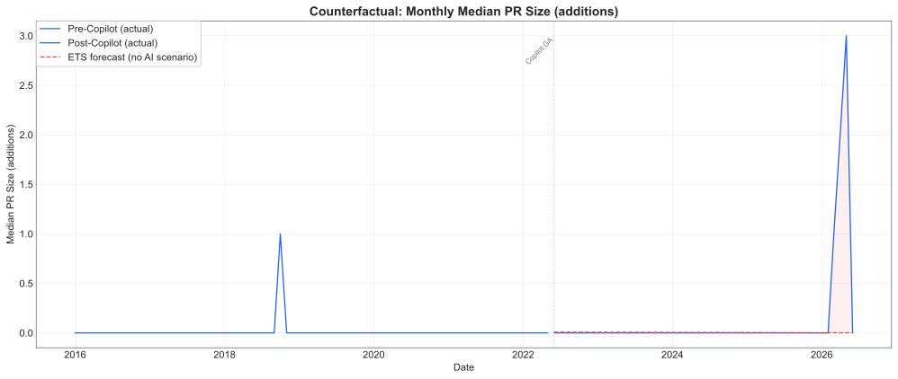

PRs are 35% larger than expected. The pre-AI trend showed slow growth in PR size; post-AI, the growth accelerated.

**Counterfactual conclusion:** AI tools appear to have accelerated every metric: more contributors, more PRs, larger PRs, but also more rejections. The most striking finding is that the rejection rate trend *reversed*. Before AI, projects were getting better at accepting contributions. After AI, that progress stopped and rejection climbed. This suggests that while AI lowers the barrier to *submitting* code, it may not be raising the quality enough to clear the bar that maintainers set.

### 6. The Health Index

We constructed a composite health score (0-100) from five components: response time, merge rate, contributor diversity, activity trend, and bus factor (Gini coefficient of contribution concentration).

Initial finding: **popularity (stars) does not strongly correlate with health.** Some of the most-starred repos score below average on health, while newer, less-known projects score highest.


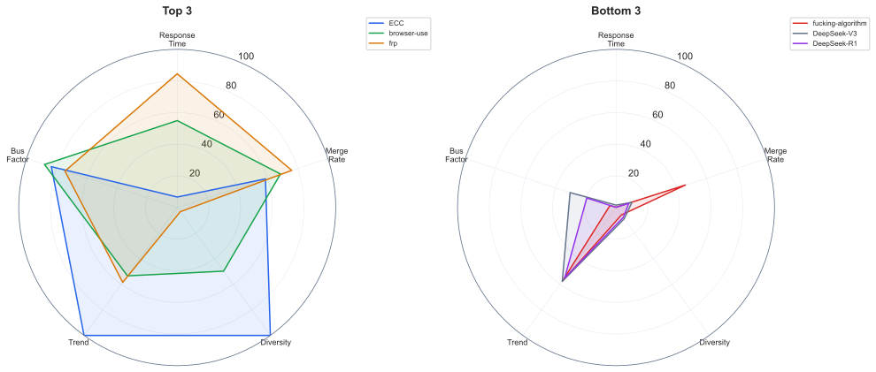

### 7. PR Survival Analysis

Kaplan-Meier survival curves show distinct patterns by author type: maintainer PRs have a near-vertical drop (resolved within hours), while first-timer PRs have a long tail extending months.

This has implications for contributor retention (Finding #4): if first-timers wait days or weeks for their PR to be reviewed, they're unlikely to contribute again.

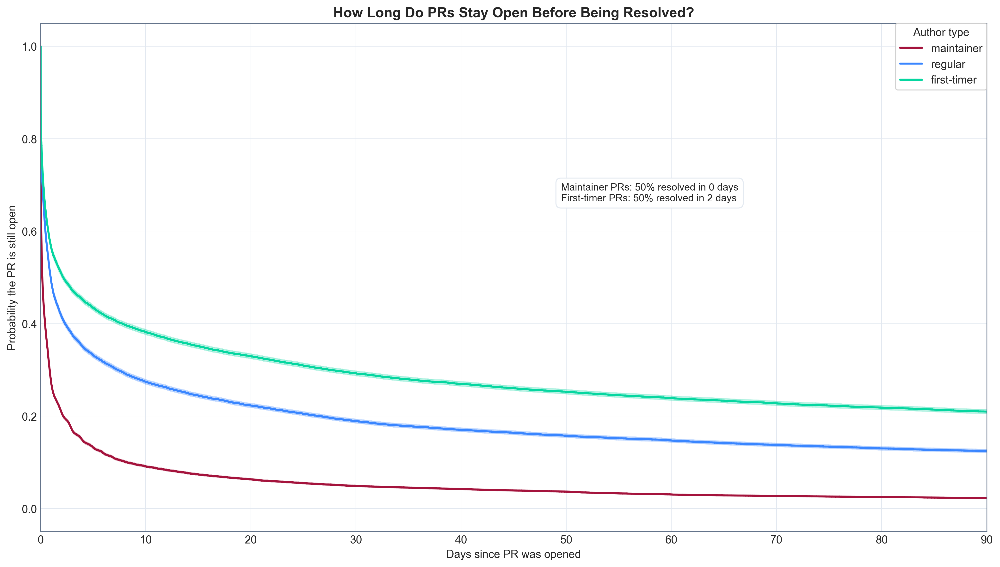

### 8. The Hacktoberfest Effect

October is Hacktoberfest month, when contributors are incentivized to open PRs. The effect is real and massive: October PR volume spikes up to **+260%** above the monthly average (2022). But the merge rate in October is consistently **lower** than other months, suggesting many Hacktoberfest PRs don't meet the quality bar.

The spike peaked in 2022 and has moderated since, possibly reflecting the 2020 rule change requiring repos to opt-in and the general increase in baseline PR volume.

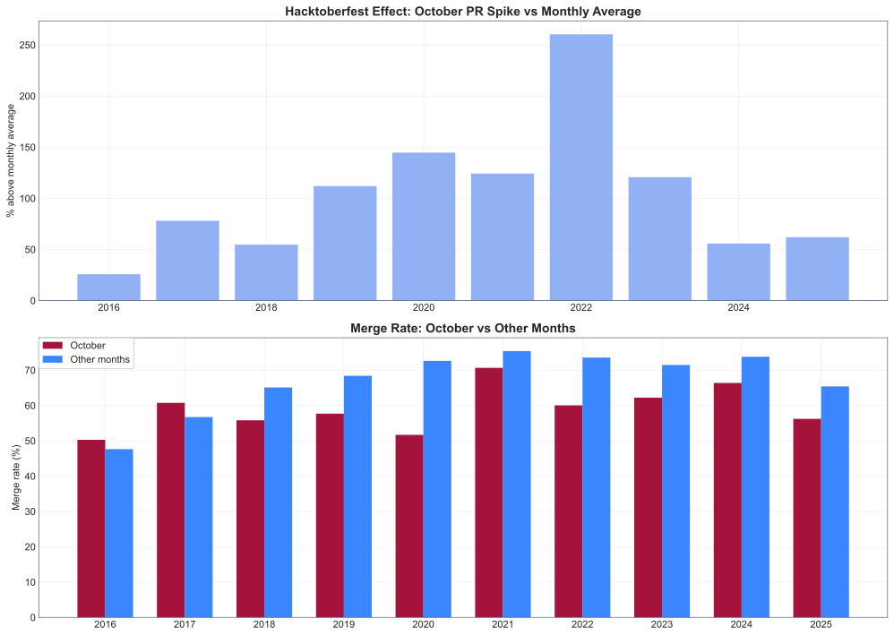

### 9. How Do Language Ecosystems Compare?

Not all open-source communities behave the same. Comparing merge rates and response times across programming languages reveals significant differences (Kruskal-Wallis H=264.2, p<0.0001).

**TypeScript** projects have the highest merge rate (78.5%), while **Python** and **JavaScript** hover around 50%. This may reflect different community cultures, project maturity distributions, or the types of contributions each ecosystem attracts.

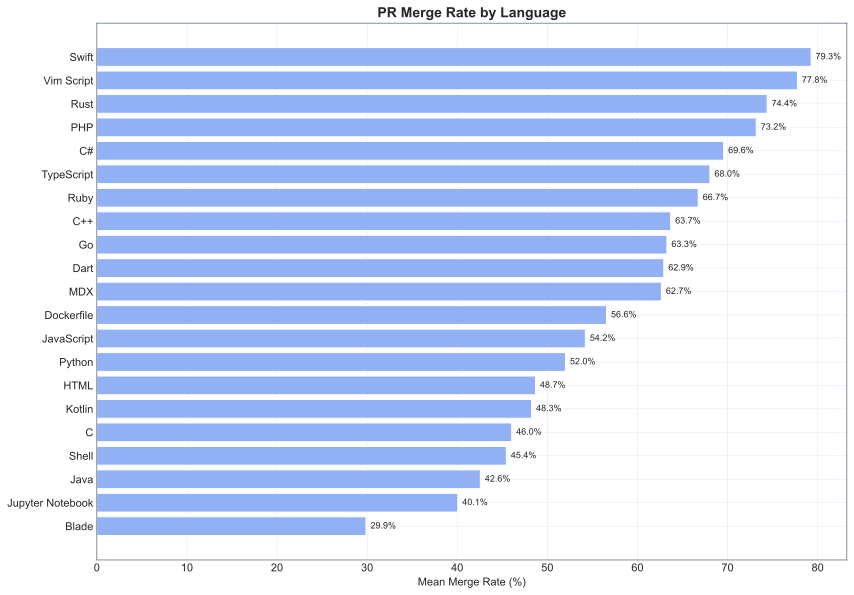
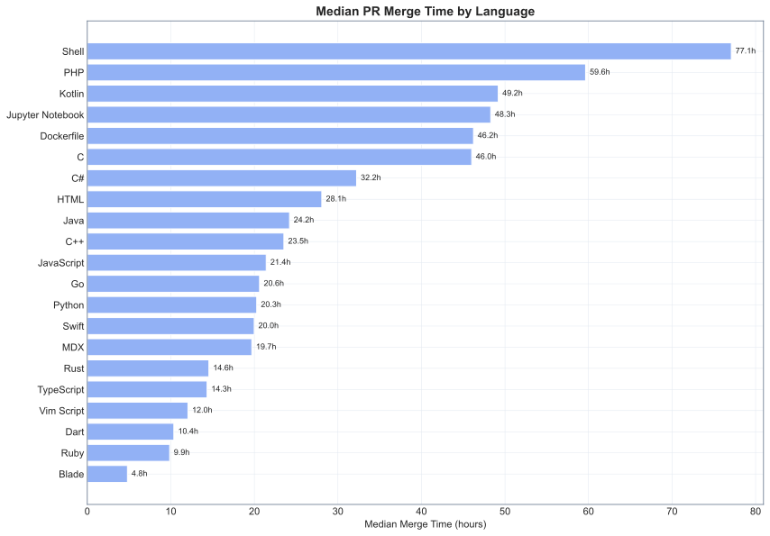

### 10. What Predicts PR Abandonment?

We trained Random Forest and XGBoost classifiers to predict which PRs will be abandoned (open >90 days without activity). The most important feature by far is **author type**: maintainer PRs almost never get abandoned, while first-timer PRs are at highest risk.

PR size matters less than expected. The model achieves AUC=0.736, meaning author history is a moderate but meaningful predictor of whether a PR will be left to die.

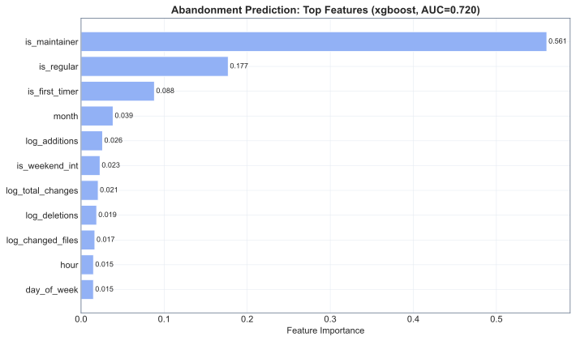

### 11. Forecasting: Which Model Predicts PR Volume Best?

We benchmarked four time-series models on the aggregate monthly PR volume (80/20 temporal split):

| Model | MAE | RMSE | MAPE |
|-------|-----|------|------|
| **ETS** | **550** | **991** | **17.7%** |
| Prophet | 648 | 1,050 | 22.5% |
| ARIMA | 829 | 1,235 | 30.2% |
| XGBoost | 1,012 | 1,393 | 38.1% |

ETS (Exponential Smoothing) wins with 17.7% MAPE. Prophet is a close second. The traditional ARIMA and ML-based XGBoost perform worse on this data, likely because the series has strong trend and seasonality that ETS handles natively.

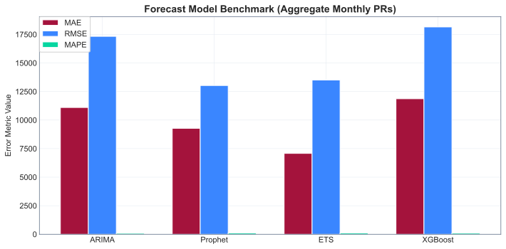

---

## What's Next

This is a first draft based on 156 of 200 targeted repos. The extraction is running and will complete soon. Planned updates:

- **Re-run all analyses** with the full 200-repo dataset
- **Comparative by organization type**: company-backed vs community vs foundation
- **Cross-correlation**: do repos that respond faster retain more contributors?

---

## Reproducibility

### Setup

```bash
git clone https://github.com/EdenRochmanSharabi/oss-pulse.git
cd oss-pulse
python3 -m venv .venv && source .venv/bin/activate
pip install -e ".[dev]"
```

### Run the analysis

```bash
# With real data (requires extracted parquets in data/raw/repos/)
make transform && make analyze && make figures

# Or run the narrative notebook
jupyter notebook notebooks/00_narrative_analysis.ipynb
```

### Run tests

```bash
make test          # 134 tests, 85% coverage
make lint          # ruff
make typecheck     # mypy --strict
```

---

## Project Structure

```
src/oss_pulse/
  extract/       GitHub API client, BigQuery client, repo discovery
  transform/     Cleaning, bot detection, classification, feature engineering
  analyze/       Time series, forecasting, survival analysis, health index
  visualize/     matplotlib plots, heatmaps, dashboards

notebooks/
  00_narrative_analysis.ipynb   Main analysis (start here)

tests/
  fixtures/      Real data sample for integration tests
  test_*.py      134 tests covering all modules

docs/
  process_log.md Project diary with challenges and decisions

config/
  repos.csv      Repo classification
  events.csv     AI tool releases, Hacktoberfest dates, conferences
```

## License

[CC BY 4.0](https://creativecommons.org/licenses/by/4.0/)
