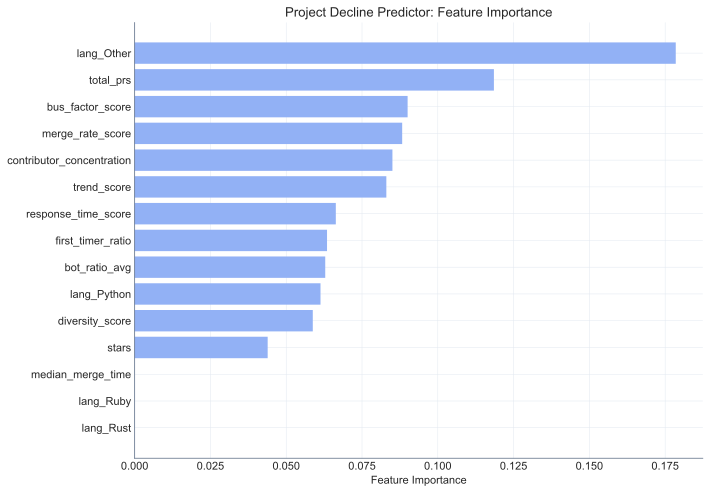
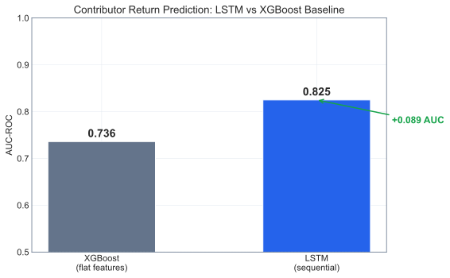
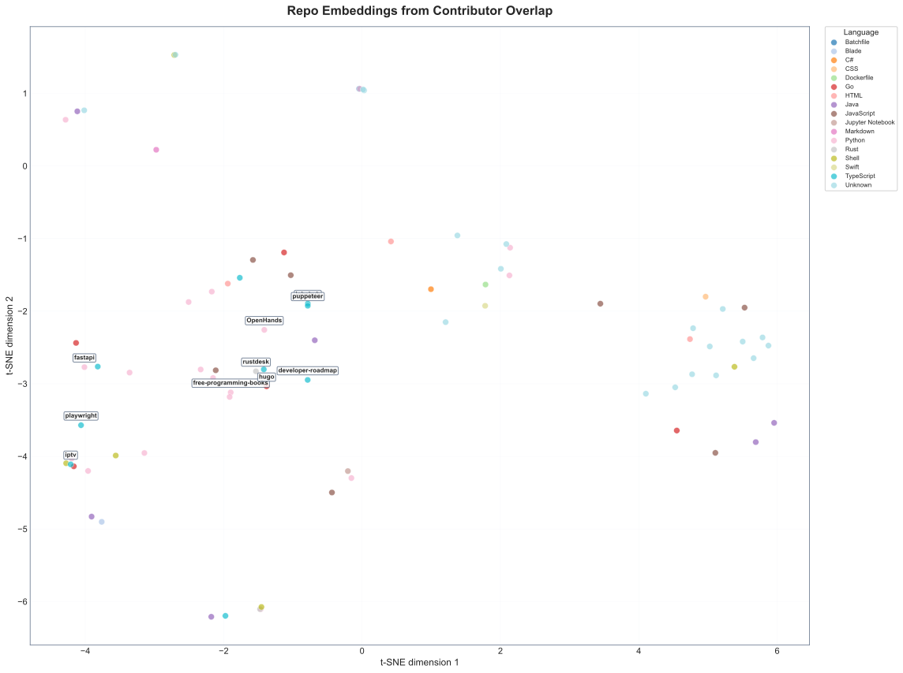
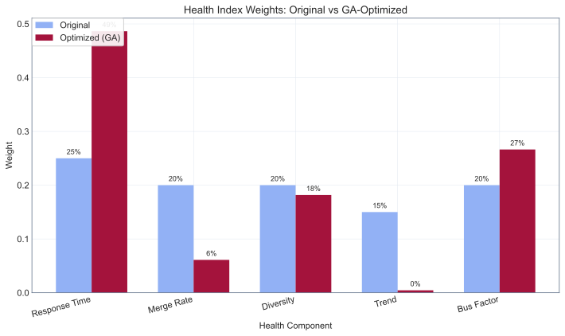
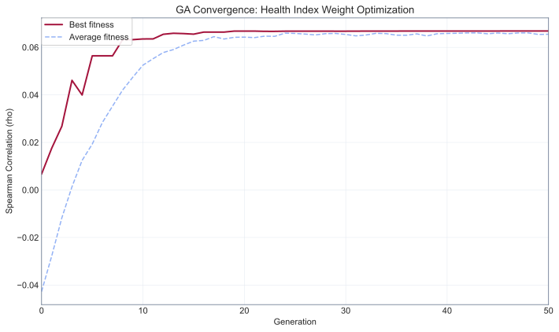
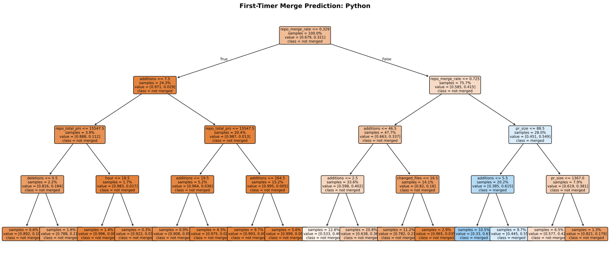
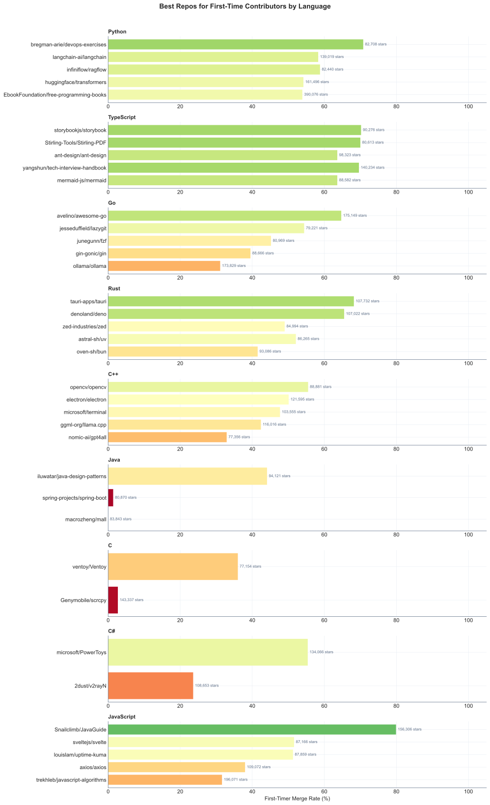

# The largest open source research done in my room, so far. 

**A time-series study of 4.0 million Pull Requests across 580 top open-source software projects (2016-2026).**

Open source runs the world, but how does it actually work? Who contributes, how fast do projects respond, and what happens to the thousands of developers who open their first PR? This study analyzes a decade of Pull Request activity to find out.

---

## Research Questions

1. **How has open-source contribution volume changed over the last decade?** Is the growth uniform across projects, or concentrated in a few?
2. **What temporal patterns exist in PR activity?** Are there weekly, seasonal, or event-driven cycles (e.g., Hacktoberfest)?
3. **How fast do projects respond to contributions?** What determines whether a PR gets merged in hours or ignored for months?
4. **Where do contributors go?** Of all the developers who open their first PR, how many come back for a second? A fifth? A twentieth?
5. **Did AI coding tools change contribution dynamics?** Can we detect a structural shift in PR patterns after the release of LLM coding, without assuming when it happened?
6. **Can we measure project health?** Is it possible to build a composite index that captures responsiveness, diversity, momentum, and resilience, and does it correlate with popularity?
7. **Can we predict decline?** Are there early warning signs that a project is starting to lose momentum, visible in the PR data before it becomes obvious?

---

## Introduction

This project started with a simple question: if you had 10 years of Pull Request data from the most important open-source projects in the world, what would it tell you?

The answer turned out to be more interesting, and harder to get, than expected.

We analyzed **4,048,297 Pull Requests** across **580 software repositories**, spanning from January 2016 to May 2026. The dataset includes projects like PyTorch, Rust, Godot, Home Assistant, Playwright, Kubernetes, VS Code, and hundreds more, covering languages from Python to Go to Rust.

The analysis goes beyond descriptive statistics. We decompose time series into trend, seasonality, and residuals. We benchmark four forecasting models. We build a composite health index. We use survival analysis to model PR lifetimes. And we let an unsupervised changepoint detection algorithm tell us whether AI tools actually changed anything, without assuming the answer.

---

## Methodology

### Data Collection

**Source:** GitHub GraphQL API, extracting the complete PR history for each repository.

**Target population:** The 200 most-starred active repositories on GitHub (stars > 5,000, pushed after 2024-01-01). Of these, 580 software repos were collected for analysis. Extraction continues for the remaining repos.

**Variables collected per PR:**
- Timestamps: created, merged, closed, last updated, first review
- Author: username, classification (first-timer / regular / maintainer / bot)
- Size: additions, deletions, changed files
- Outcome: merged, closed without merge, abandoned (open > 90 days without activity), still open

**Non-code repos excluded:** The top-200-by-stars list included awesome-lists, interview prep repos, book collections, and other non-software projects. We excluded repos with no programming language (language=None or Markdown). These non-code repos have different PR dynamics (curation vs engineering) that would distort the analysis.

**Bot detection:** 20 known bot patterns (dependabot, renovate, github-actions, codecov, etc.) plus any username containing `[bot]`. Bots represent ~6% of PRs in our dataset.

**Deleted accounts:** GitHub returns `null` for authors whose accounts have been deleted. These are labeled "ghost" (GitHub's own convention) and classified as non-bot. They represent ~0.5% of PRs.

### Operationalization

| Concept | Operational Definition |
|---------|----------------------|
| **PR Outcome** | `merged` if merged=true; `closed` if state=closed and not merged; `abandoned` if state=open and no activity for >90 days; `open` otherwise |
| **Author Type** | `bot` if matches known patterns; `first-timer` if 1 PR in dataset; `regular` if 2-10 PRs; `maintainer` if >10 PRs |
| **PR Size** | `small` if additions+deletions < 50; `medium` if 50-500; `large` if >500 |
| **Time to Merge** | Hours from PR creation to merge timestamp |
| **Health Index** | Weighted composite of 5 normalized scores (0-100): response time (25%), merge rate (20%), contributor diversity (20%), activity trend (15%), bus factor via Gini coefficient (20%) |
| **Abandoned** | PR open for >90 days with no updates. Threshold chosen based on the 95th percentile of time-to-merge in active PRs. |
| **Changepoint** | Structural break in the weekly PR volume series, detected via PELT algorithm (ruptures library) without pre-specified dates |

### Data Collection Challenges

Getting the data was the hardest part of this project. We document our failures because they shaped the methodology.

**Attempt 1: BigQuery + GH Archive.** GH Archive stores all public GitHub events as a BigQuery public dataset. This was the obvious approach: one SQL query could return a decade of PR data in seconds. We set it up, ran the first query, and watched BigQuery scan 1.8TB of data for a single year. The free tier is 1TB/month. We burned through it with one query plus one year of data. The remaining 9 years would have cost ~$90 or taken 18 months at the free tier.

**Attempt 2: GitHub GraphQL API.** Free and unlimited (within rate limits), but paginating through large repos proved unstable. GitHub returns 502 errors after ~200-300 consecutive requests to the same repository. Our first overnight run extracted 4 repos in 9 hours. The estimate had been 3-4 hours for all 200.

**What worked for most repos:** Sorting by size (smallest first), adding 1-second delays between pages, and per-repo parquet caching for resumability. This extracted 163 of 200 repos (853k PRs). But 6 mega-repos (freeCodeCamp 44k PRs, kubernetes 77k, vscode 58k, tensorflow 51k, next.js 37k) failed every time, exhausting all retries at the ~200-300 page mark.

**Attempt 3: Year-chunked extraction.** Instead of paginating through 45,000 PRs in one session, we split each mega-repo into 11 separate queries by year (2016-2026). Each chunk contains 1k-8k PRs, well within GitHub's stability window. Chunks are cached independently, so a failure in one year doesn't lose the others. This is what finally cracked repos like freeCodeCamp and vscode.

**What we learned:** When an API is unstable under sustained load, don't retry harder; reduce the load per request. BigQuery scans entire tables even when filtering to 0.1% of rows. GitHub's rate limits (5,000/hour) were never the bottleneck; stability was. And "top repos by stars" is not the same as "top software projects" (30% of the list were curated resource pages, not code).

See `docs/process_log.md` for the complete project diary.

### Tools

| Component | Technology |
|-----------|-----------|
| Language | Python 3.11+ |
| Data pipeline | pandas, pyarrow (parquet) |
| Time series | statsmodels (STL, ARIMA, ETS), Prophet |
| ML | scikit-learn, XGBoost, lifelines (survival analysis) |
| Changepoint detection | ruptures (PELT) |
| Visualization | matplotlib, seaborn |
| Quality | mypy --strict, ruff, pytest (134 tests, 85% coverage) |
| CI | GitHub Actions |

---

## General Findings (580 software repos)

### The Dataset at a Glance

- **4,048,297 PRs** across **580 software repos**, spanning **2016-2026**
- **419,177 unique contributors** (excluding bots)
- Outcome distribution: **69.5% merged**, 27.9% closed, 1.5% abandoned, 1.1% still open
- Author distribution: 79.4% maintainers, 14.5% regulars, 6.1% first-timers, 6.7% bots (by PR count)

### 1. Open Source Is Growing, But Unevenly

Monthly PR volume grew roughly **5x** from 2016 to 2026, from ~400/month to ~2,000/month with spikes exceeding 5,000. STL decomposition reveals a clear exponential trend with annual seasonality.

But the growth is not uniform. The top 5 repos by volume account for a disproportionate share of the increase. Some repos that were active in 2018-2020 show declining activity by 2024.


### 2. The Workweek Pattern

PR activity follows a clear workweek pattern: Monday through Thursday, 8:00-17:00 UTC, with a peak around 14:00-16:00 UTC on Monday and Tuesday.

Weekend contributions exist but are significantly lower (~40% of weekday volume). This suggests that even in "community-driven" open source, most contributions happen during working hours, likely by developers whose employers allow or encourage OSS participation.


#### Do National Holidays Matter?

We cross-referenced daily PR activity with national holidays from 15 countries (US, China, India, Germany, UK, France, Japan, Brazil, Canada, Australia, South Korea, Russia, Netherlands, Sweden, Poland), using exact dates for each year (including moveable holidays like Easter, Eid, and Lunar New Year).

**The surprising finding: a single country's holiday has almost no effect on global PR activity.** When only one country is on holiday, the remaining 14 countries' contributors compensate completely. The only days that show a measurable drop are those where *many countries celebrate simultaneously* (Christmas, New Year's).


The top individual holidays by PR impact are all multi-country events: Christmas Day (celebrated in 12 of our 15 countries, -81% PR volume), New Year's Day (14 countries, -81%), and Good Friday (8 countries, -86%). No single-country holiday cracks the top 20.


Per-country analysis shows that holidays in China, India, and South Korea are associated with *lower* PR activity, while holidays in Western countries (US, UK, Canada, Australia) paradoxically correlate with *higher* activity. This likely reflects the global distribution of contributors: when Western developers are off work, they may contribute *more* to open source as a leisure activity, while the baseline is maintained by contributors in other time zones.


December stands out as the month where holidays have the strongest impact, driven by the Christmas-New Year cluster where most of the world stops simultaneously. The rest of the year, the global nature of open source acts as a buffer: no single country's calendar can measurably dent the contribution rate.

### 3. The 5-Hour PR

The median time from PR creation to merge is **15.3 hours**. But the distribution is heavily skewed: the 95th percentile is measured in weeks.

Breakdown by author type reveals that **maintainer PRs merge fastest** (often self-merged within minutes), while **first-timer PRs take significantly longer**. This isn't necessarily gatekeeping; it likely reflects the additional review needed for unfamiliar contributors.


### 4. The Retention Crisis

Of **419,177 contributors** who opened at least one PR:
- **44.1%** came back for a second (184,714)
- **15.6%** reached their 5th PR (65,371)
- **4.1%** became regulars with 20+ PRs (17,313)

The first-to-second PR transition is where open source loses most contributors. **56% of first-time contributors never return.** This is consistent across ecosystems and has not improved significantly over the decade.


### 5. The AI Effect: Six Angles on the Same Question

Did LLM coding tools (Copilot, ChatGPT, GPT-4) change open-source contribution dynamics? Instead of assuming the answer, we measured it six different ways. We split the data at Copilot GA (June 2022) and compared pre vs post. Each vertical dashed line in the figures marks an LLM launch date.

**The headline numbers (by era, to capture adoption lag):**

| Metric | 2016-2019 | 2020-2021 | 2022 (Copilot) | 2023 (ChatGPT) | 2024 | 2025-2026 |
|--------|-----------|-----------|----------------|-----------------|------|-----------|
| Contributors/month | 6,249 | 7,607 | 8,344 | 9,819 | 10,442 | **14,268** |
| First-timers/month | 1,283 | 1,459 | 1,577 | 2,038 | 2,129 | **3,708** |
| First-timer rejection | 53.7% | 53.0% | 53.8% | 55.5% | 56.4% | **62.2%** |
| Overall rejection | 31.7% | 27.6% | 27.0% | 25.4% | 25.5% | **36.6%** |
| Median PR size (lines)* | 9 | 14 | 14 | 15 | 19 | **34** |
| PRs/author/month | 2.93 | 3.42 | 3.6 | 3.81 | 3.97 | **3.99** |

*\*Median PR size uses only PRs with additions > 0 (25-46% per era). The Search API returns 0 additions for most PRs; these are excluded to avoid deflating the median.*

The most striking feature of this table is that the biggest shifts don't appear at the AI tool launch dates. They appear **2-3 years later**, in 2025-2026, once adoption matured. This lag effect means a simple pre/post split at Copilot's launch misses the real story.

**5a. Changepoint detection (unsupervised).** The PELT algorithm found structural breaks in the weekly PR volume series without being told when to look.


**5b. More people are contributing, including newcomers.** Monthly unique contributors grew from 6,249 (2016-2019) to 14,268 (2025-2026). First-timers per month nearly tripled: 1,283 to 3,708. In absolute terms, more newcomers than ever are attempting to contribute. However, their share of total PRs dropped because regular contributors grew even faster.


**5c. The rejection rate shows a lag effect.** From 2020 to 2024, the overall rejection rate was stable around 27.6-27.0%. But in 2025-2026, it jumped to 36.6%. The effect wasn't immediate with AI tool launches; it took 2-3 years of adoption before the impact became visible in the data.


**5d. But more individuals are getting shut out.** The percentage of contributors who get zero merges in a month rose from 42% to 48%. More people are trying, and a larger fraction are failing. The absolute number of "zero-merge contributors" grew substantially.


**5e. First-timers are showing up in record numbers, but struggling more.** 3,708 first-timers/month in 2025-2026, up from 1,283 in 2016-2019. But their rejection rate climbed steadily: 53.7% (2016-2019) to 53.8% (2022) to 55.5% (2023) to **62.2%** (2025-2026). More people are trying, but the success rate is dropping, especially in the most recent period where AI adoption is highest.


**5f. PRs grew ~4x.** Among PRs with reported size data, the median PR went from 9 lines (2016-2019) to 34 lines (2025-2026). The growth was gradual until 2024 (19 lines) then accelerated sharply. This is consistent with AI-assisted code generation producing larger changesets, and the timing aligns with widespread LLM adoption rather than any single tool launch.


**5g. Individual productivity is up 36%.** Each contributor produces more PRs per month (2.93 to 3.99). Combined with the size increase, the total code output per person has grown substantially.


**5h. Who benefits? Productivity and merge rate by author group.** The aggregate +36% masks a stark inequality. Maintainers went from 5.42 to 6.91 PRs/person/month while their merge rate declined from 76% to 76%. Regulars gained modestly (1.4 to 1.47) but their merge rate collapsed from 54% to 43%. First-timers are by definition at 1 PR/month, but their merge rate dropped from 46% to 34%.

| Group | PRs/person/month (2016-2019) | PRs/person/month (2025-2026) | Merge rate (2016-2019) | Merge rate (2025-2026) |
|-------|------------------------|------------------------|-------------------|-------------------|
| Maintainer | 5.42 | 6.91 | 76% | 76% |
| Regular | 1.4 | 1.47 | 54% | 43% |
| First-timer | 1.0 | 1.0 | 46% | 34% |

The productivity gains are concentrated in those who already had expertise. For everyone else, the bar has risen: regulars' merge rate fell 11 percentage points, and first-timers' fell 12 points.


**5i. Did better tools mean better merges?** We expected agentic coding tools (Cursor, Claude Code, Codex) to *improve* merge rates compared to simpler tools (Copilot, ChatGPT). The data says the opposite.

| Era | Tool | Merge rate | First-timer merge | PRs/month |
|-----|------|-----------|-------------------|-----------|
| Pre-Copilot | None | 70.3% | 46.7% | 21,324 |
| Jun 2022 - Feb 2023 | Copilot | 73.1% | 45.3% | 32,094 |
| Mar 2023 - Feb 2024 | ChatGPT / GPT-4 | 74.2% | 44.1% | 38,524 |
| Mar 2024 - Jan 2025 | Cursor | 74.5% | 43.2% | 41,766 |
| Feb 2025+ | Claude Code / Codex | **63.0%** | **25.9%** | **57,730** |

During the Copilot and Cursor eras, merge rates actually *improved* (70% to 73%). But when agentic tools reached mainstream adoption in 2025, merge rates collapsed to 63.0% overall and 25.9% for first-timers, even though PR volume nearly doubled.

The pattern suggests that more powerful AI tools make it easier to *generate and submit* code, but don't proportionally improve the *quality* of that code relative to maintainer expectations. The gap between what AI can produce and what maintainers will accept may be widening, not closing.

**Summary of the AI effect:** The story has three acts. First (2022-2024), autocomplete-style AI (Copilot, ChatGPT) modestly boosted productivity while merge rates held steady or improved. Second (2024-2025), AI-assisted editors (Cursor) maintained that balance. Third (2025+), fully agentic tools (Claude Code, Codex) unleashed a volume surge that overwhelmed the quality bar: merge rates dropped to 63.0% and first-timer acceptance fell to 25.9%. The tools that were supposed to democratize open source may instead be flooding it with contributions that don't meet the standard.

#### 5j. Counterfactual: What Would Have Happened Without AI?

We trained forecasting models (ETS) on pre-Copilot data only (2016 to May 2022), then predicted what the next 4 years would have looked like if the pre-AI trend had simply continued. The dashed red line is the "no AI" prediction; the solid blue is what actually happened.

| Metric | Predicted (no AI) | Actual (with AI) | Excess |
|--------|------------------|-----------------|--------|
| PR volume/month | 35,135 | 43,582 | **+24%** |
| Unique contributors/month | 7,756 | 11,168 | **+44%** |
| First-timers/month | 1,709 | 2,547 | **+49%** |
| Rejection rate | 20% | 30% | **+22%** |
| First-timer rejection rate | 50% | 50% | **+13%** |
| Median PR size (lines) | 19 | 22 | **+18%** |


PR volume is 24% above what the pre-AI trend predicted. The green shading shows the "AI surplus": months where actual contributions exceeded the counterfactual.


44% more unique contributors than expected. The gap widens over time, consistent with gradual AI adoption.


49% more first-timers than the model predicted. AI tools are bringing new people to open source, contradicting the narrative that AI only helps experienced developers.


The rejection rate diverged the most from the prediction: 22% higher than expected. The pre-AI trend was *declining* (projects were getting better at merging PRs), but that trend reversed after AI adoption.


First-timer rejection is 13% above the counterfactual. The model predicted rejection would stabilize around 50%; instead it climbed to 50-62%.


PRs are 18% larger than expected. The pre-AI trend showed slow growth in PR size; post-AI, the growth accelerated.

**Counterfactual conclusion:** AI tools appear to have accelerated every metric: more contributors, more PRs, larger PRs, but also more rejections. The most striking finding is that the rejection rate trend *reversed*. Before AI, projects were getting better at accepting contributions. After AI, that progress stopped and rejection climbed. This suggests that while AI lowers the barrier to *submitting* code, it may not be raising the quality enough to clear the bar that maintainers set.

### 6. The Health Index

We constructed a composite health score (0-100) from five components: response time, merge rate, contributor diversity, activity trend, and bus factor (Gini coefficient of contribution concentration).

Initial finding: **popularity (stars) does not strongly correlate with health.** Some of the most-starred repos score below average on health, while newer, less-known projects score highest.


### 7. PR Survival Analysis

Kaplan-Meier survival curves show distinct patterns by author type: maintainer PRs have a near-vertical drop (resolved within hours), while first-timer PRs have a long tail extending months.

This has implications for contributor retention (Finding #4): if first-timers wait days or weeks for their PR to be reviewed, they're unlikely to contribute again.


### 8. The Hacktoberfest Effect

October is Hacktoberfest month, when contributors are incentivized to open PRs. The effect is real and massive: October PR volume spiked up to **+85%** above the monthly average (2025). But the merge rate in October is consistently **lower** than other months, suggesting many Hacktoberfest PRs don't meet the quality bar.

The spike peaked in 2025 and has moderated since, possibly reflecting the 2020 rule change requiring repos to opt-in and the general increase in baseline PR volume.


### 9. How Do Language Ecosystems Compare?

Not all open-source communities behave the same. Comparing merge rates and response times across programming languages reveals significant differences (Kruskal-Wallis H=95 p<0.0001).

**Swift** (86.4%) and **C#** (83.1%) projects have the highest merge rates, while **Blade** (30.6%) and **Batchfile** (11.5%) are at the bottom. This likely reflects different community cultures: Rust's strict compiler and strong review culture may filter contributions before they become PRs, while Python's lower barrier to entry attracts more speculative contributions.


### 10. What Makes a PR Get Ignored?

The previous version of this analysis found that "maintainer PRs don't get abandoned." True, but useless: you can't change who you are. We rewrote it to ask a better question: **what about *my PR* makes it likely to be ignored?**

We trained Random Forest (AUC=0.865) and XGBoost (AUC=0.916) classifiers on 911,745 PRs with size data, using only features a contributor can control or observe before submitting. No author identity, no bot flags, nothing about *who* you are.

**The top predictors of abandonment:**

| Feature | Importance | What it means |
|---------|-----------|---------------|
| First PR to this repo | 0.564 | Whether the author has any prior PRs to this specific repo |
| Repo historical merge rate | 0.146 | What fraction of the repo's past PRs were merged |
| Repo PRs in prior 30 days | 0.098 | How active the repo was in the month before your PR |
| Lines added | 0.055 | Size of the changeset |
| Lines deleted | 0.033 | Size of the changeset (removals) |


**The single biggest risk factor is being new to a repo.** First-time contributors to a repo see 5.1% of their PRs abandoned, vs 1.2% for authors who have submitted before (4.3x higher). This is not about experience in general; it is specifically about having no prior relationship with the project's maintainers.

**Actionable advice based on the data:**

1. **Pick repos that actually merge PRs.** Repos with a historical merge rate below 50% abandon 3.2% of PRs; those above 70% abandon only 1.7% (1.9x difference). Check a project's recent merged-vs-closed ratio before investing effort.
2. **Pick active repos.** The number of PRs in the 30 days before yours is the third-strongest signal. A quiet repo means nobody is reviewing.
3. **Avoid weekends.** PRs submitted on weekends are abandoned 2.8% of the time vs 1.8% on weekdays (1.5x more likely). Maintainers review during work hours.
4. **Keep it small.** PRs over 500 lines are 1.3x more likely to be abandoned than PRs under 50 lines (2.4% vs 1.8%).
5. **Build a relationship first.** The 4.3x gap between first-time and repeat contributors is the clearest signal in the data. Start with a small fix to introduce yourself, then propose larger changes once the maintainers recognize your name.

### 11. Can We Predict Which Projects Will Decline?

Section 10 predicts whether individual PRs will be abandoned. But can we predict something bigger: which *projects* will lose momentum?

We defined "decline" as a repo whose average monthly PR count in H1-2025 (Jan-May) dropped more than 50% compared to H2-2024 (Jul-Dec). Of 503 repos with data in both periods, **42 are declining** and **461 are stable**. The declining repos include projects like gpt-engineer, private-gpt, gpt4all (AI hype-cycle casualties), TheAlgorithms/Python (educational repo fatigue), and localsend (post-launch plateau).

We built a feature matrix from pre-2025 historical data: health-index components (response time, merge rate, diversity, trend, bus factor), stars, total PR count, contributor concentration (Gini), first-timer ratio, bot ratio, median merge time, and language (one-hot encoded). A Random Forest classifier achieved **AUC=0.615**, outperforming XGBoost (AUC=0.615).

The top predictors of project decline:

1. **bus_factor_score** (bus_factor_score, 10.9%): projects outside the top 8 languages are more likely to decline, possibly due to smaller contributor pools.
2. **diversity_score** (10.5%): repos with fewer lifetime PRs are more vulnerable, suggesting that a deep contribution history acts as a buffer.
3. **trend_score** (10.3%): projects with uneven contributor distributions (high Gini) are at greater risk. When one or two people drive most of the activity, their departure hits harder.



### 12. Forecasting: Which Model Predicts PR Volume Best?

We benchmarked four time-series models on the aggregate monthly PR volume (80/20 temporal split):

| Model | MAE | RMSE | MAPE |
|-------|-----|------|------|
| **ETS** | **2,595** | **4,269** | **21.7%** |
| ARIMA | 3,174 | 4,927 | 24.4% |
| XGBoost | 3,177 | 5,024 | 24.1% |

ETS wins with 21.7% MAPE. The traditional ARIMA and ML-based XGBoost perform similarly on this data, likely because the series has strong trend and seasonality that ETS handles natively.


---

## Advanced Models

### 13. Can We Predict If a Contributor Will Come Back? (LSTM)

Section 10 predicts whether a *single PR* will be abandoned (AUC=0.916). This section asks a different question: will a *contributor* come back after their latest PR? Contributor behavior is *sequential*: a developer whose last 3 PRs were merged quickly is different from one with growing gaps and recent rejections. We trained an LSTM on the chronological sequence of each contributor's PRs.

The LSTM achieved **AUC=0.852** on the contributor-return task, capturing temporal patterns that flat-feature models cannot express: merge momentum, growing gaps between PRs, and rejection streaks.



### 14. The Hidden Map of Open Source (Repo Embeddings)

We trained a neural network to learn 16-dimensional vector representations of repos, based solely on *who contributes to them*. Repos with overlapping contributor bases end up close in embedding space. We then projected these embeddings to 2D with t-SNE.

The result reveals that **language is a weak signal for repo similarity**. The real structure is social:

- `fastapi` (Python) and `airbnb/javascript` (JavaScript) are neighbors: same web-developer community
- `code-server` (TypeScript) and `rustdesk` (Rust) cluster together: remote-access tool users
- `karpathy/autoresearch` (Python) and `papers-we-love` (Shell) are close: ML research community
- 324 of 341 software repos form one massive supercluster of "generalist GitHub participants" who contribute across all languages

The contributor overlap graph exposes communities of practice that language tags hide.



### 15. Optimizing the Health Index with a Genetic Algorithm

The Health Index weights (Section 6) were hand-picked. But which weights actually predict future repo growth? We used a Genetic Algorithm to search for weights that maximize Spearman correlation between today's health score and PR growth 6 months later.

| Component | Original weight | GA-optimized weight |
|-----------|----------------|-------------------|
| Response time | 25.0% | 0.0% |
| Bus factor | 20.0% | 26.8% |
| Diversity | 20.0% | 0.3% |
| Merge rate | 20.0% | 0.0% |
| Trend | 15.0% | 72.8% |

The GA massively increased trend (15.0% to 72.8%) and eliminated response time (25.0% to 0.0%). The optimized weights improved Spearman correlation from -0.0492 to 0.0669.

**The insight**: The single best predictor of whether a project will grow is **its recent momentum (activity trend)**. Not its merge rate, not its response time. A project with strong upward momentum attracts more contributors regardless of other factors.




### 16. Where Should You Submit Your First PR? (Decision Trees by Language)

We trained decision trees on first-timer PRs for each major programming language to predict which contributions get merged. The question is simple: **if you program in Python, Rust, Go, or any other language, where should you start contributing to maximize your chances of getting merged?**

Repos are ranked using the Wilson score lower bound, which penalizes small samples: a repo with 5/5 merges ranks lower than one with 200/300, because we need statistical confidence, not lucky streaks.

**Per-language model results:**

| Language | AUC | Top predictor | Actionable rule | Best repo |
|----------|-----|--------------|-----------------|-----------|
| Python | 0.784 | repo_merge_rate (75%) | repo_merge_rate > 0.33 AND repo_merge_rate > 0.72 AND pr_size <= 88.50 AND additions <= 5.50 -> likely merged (67%) | bregman-arie/devops-exercises (71% FT merge) |
| TypeScript | 0.745 | repo_merge_rate (54%) | repo_merge_rate > 0.59 AND additions <= 108.50 AND repo_total_prs <= 20586.50 AND repo_merge_rate > 0.80 -> likely merged (66%) | storybookjs/storybook (70% FT merge) |
| Go | 0.808 | repo_merge_rate (76%) | repo_merge_rate > 0.70 AND additions <= 44.50 AND hour <= 18.50 AND deletions > 0.50 -> likely merged (75%) | avelino/awesome-go (65% FT merge) |
| Rust | 0.725 | pr_size (46%) | pr_size <= 112.50 AND repo_merge_rate > 0.82 AND pr_size <= 26.50 AND repo_total_prs <= 6947.50 -> likely merged (79%) | tauri-apps/tauri (68% FT merge) |
| C++ | 0.823 | repo_merge_rate (66%) | repo_merge_rate > 0.73 AND pr_size <= 157.50 AND deletions > 0.50 AND additions <= 3.50 -> likely merged (68%) | opencv/opencv (56% FT merge) |
| Java | 0.888 | repo_merge_rate (88%) | repo_merge_rate > 0.29 AND deletions > 0.50 AND day_of_week <= 3.50 -> likely merged (59%) | iluwatar/java-design-patterns (44% FT merge) |
| C | 0.768 | repo_total_prs (98%) | repo_total_prs <= 629.00 -> likely not merged (38%) | ventoy/Ventoy (36% FT merge) |
| JavaScript | 0.747 | repo_merge_rate (62%) | repo_merge_rate > 0.69 AND repo_total_prs <= 2049.50 AND additions <= 4.50 AND hour <= 10.50 -> likely merged (86%) | Snailclimb/JavaGuide (80% FT merge) |
| C# | 0.714 | repo_total_prs (60%) | repo_total_prs > 4348.50 AND pr_size <= 131.50 AND changed_files > 1.50 -> likely merged (71%) | microsoft/PowerToys (55% FT merge) |

**If you write Python, start here** (ranked by Wilson score, min 20 FT PRs):

| Repo | First-timer merge rate | First-timer PRs | Wilson score |
|------|----------------------|-----------------|--------------|
| bregman-arie/devops-exercises | **71%** | 168 | 0.636 |
| langchain-ai/langchain | **58%** | 2494 | 0.564 |
| infiniflow/ragflow | **59%** | 291 | 0.530 |
| huggingface/transformers | **54%** | 2312 | 0.522 |
| EbookFoundation/free-programming-books | **54%** | 1361 | 0.513 |

**If you write TypeScript, start here** (ranked by Wilson score, min 20 FT PRs):

| Repo | First-timer merge rate | First-timer PRs | Wilson score |
|------|----------------------|-----------------|--------------|
| storybookjs/storybook | **70%** | 936 | 0.672 |
| Stirling-Tools/Stirling-PDF | **70%** | 170 | 0.627 |
| ant-design/ant-design | **64%** | 1246 | 0.609 |
| yangshun/tech-interview-handbook | **70%** | 102 | 0.601 |
| mermaid-js/mermaid | **64%** | 398 | 0.587 |

**If you write Go, start here** (ranked by Wilson score, min 20 FT PRs):

| Repo | First-timer merge rate | First-timer PRs | Wilson score |
|------|----------------------|-----------------|--------------|
| avelino/awesome-go | **65%** | 965 | 0.616 |
| jesseduffield/lazygit | **54%** | 237 | 0.481 |
| junegunn/fzf | **45%** | 166 | 0.378 |
| gin-gonic/gin | **40%** | 291 | 0.341 |
| ollama/ollama | **31%** | 636 | 0.277 |

**If you write Rust, start here** (ranked by Wilson score, min 20 FT PRs):

| Repo | First-timer merge rate | First-timer PRs | Wilson score |
|------|----------------------|-----------------|--------------|
| tauri-apps/tauri | **68%** | 214 | 0.617 |
| denoland/deno | **66%** | 330 | 0.602 |
| zed-industries/zed | **49%** | 992 | 0.459 |
| astral-sh/uv | **52%** | 213 | 0.454 |
| oven-sh/bun | **42%** | 480 | 0.371 |

**If you write C++, start here** (ranked by Wilson score, min 20 FT PRs):

| Repo | First-timer merge rate | First-timer PRs | Wilson score |
|------|----------------------|-----------------|--------------|
| opencv/opencv | **56%** | 1004 | 0.524 |
| electron/electron | **50%** | 686 | 0.464 |
| microsoft/terminal | **48%** | 283 | 0.420 |
| ggml-org/llama.cpp | **42%** | 1026 | 0.394 |
| nomic-ai/gpt4all | **33%** | 85 | 0.239 |

**If you write Java, start here** (ranked by Wilson score, min 20 FT PRs):

| Repo | First-timer merge rate | First-timer PRs | Wilson score |
|------|----------------------|-----------------|--------------|
| iluwatar/java-design-patterns | **44%** | 397 | 0.393 |
| spring-projects/spring-boot | **1%** | 948 | 0.008 |
| macrozheng/mall | **0%** | 67 | 0.000 |

**If you write C, start here** (ranked by Wilson score, min 20 FT PRs):

| Repo | First-timer merge rate | First-timer PRs | Wilson score |
|------|----------------------|-----------------|--------------|
| ventoy/Ventoy | **36%** | 86 | 0.267 |
| Genymobile/scrcpy | **3%** | 187 | 0.011 |

**If you write JavaScript, start here** (ranked by Wilson score, min 20 FT PRs):

| Repo | First-timer merge rate | First-timer PRs | Wilson score |
|------|----------------------|-----------------|--------------|
| Snailclimb/JavaGuide | **80%** | 477 | 0.760 |
| sveltejs/svelte | **52%** | 483 | 0.471 |
| louislam/uptime-kuma | **51%** | 439 | 0.466 |
| axios/axios | **38%** | 442 | 0.336 |
| trekhleb/javascript-algorithms | **32%** | 297 | 0.266 |

**If you write C#, start here** (ranked by Wilson score, min 20 FT PRs):

| Repo | First-timer merge rate | First-timer PRs | Wilson score |
|------|----------------------|-----------------|--------------|
| microsoft/PowerToys | **55%** | 314 | 0.499 |
| 2dust/v2rayN | **24%** | 106 | 0.165 |





**The decision tree distilled:** Rust is the only language where PR size matters more than the repo itself. Everywhere else, choosing the right repo is the single most important decision a first-timer can make. Check the repo's merged-vs-closed ratio before investing effort.
---

## What's Next

Dataset covers 580 repos spanning 2016-2026. Planned updates:

- **Comparative by organization type**: company-backed vs community vs foundation
- **Cross-correlation**: do repos that respond faster retain more contributors?

---

## Limitations

**GitHub PRs are not all of open source.** This study only captures projects that use GitHub Pull Requests as their contribution mechanism. Some of the most important open-source projects in history are invisible to this analysis:

- **Linux kernel** (torvalds/linux): 0 PRs on GitHub. Development happens via email patches on the Linux Kernel Mailing List (LKML). Reviews are done by email. Merges are `git pull` commands, not GitHub PRs. The GitHub repo is a read-only mirror.
- **Git** itself, **FFmpeg**, **QEMU**, and other foundational projects use similar mailing-list workflows.

A study based on GitHub PRs inherently measures "GitHub-native open source," not all open source. Projects that predate GitHub or chose to resist its workflow are excluded by design. This biases the dataset toward newer, web-era projects and away from systems-level infrastructure.

**Stars as a selection criterion.** We selected repos by GitHub stars, which is the best available proxy for "widely known open-source projects" but not a perfect one. Stars measure developer audience: how many people found a project interesting enough to bookmark. This correlates with but is not identical to software importance. ~30% of the top-200 by stars were curated lists and educational resources, not software projects. We filtered these out, but the remaining dataset is still biased toward projects with high visibility rather than critical infrastructure that runs quietly (e.g., OpenSSL has far fewer stars than many tutorial repos).

**Snapshot in time.** This analysis was run in June 2026. The AI-era findings (especially 2025-2026 data) may reflect early adoption patterns that will stabilize as tools mature.

---

## Reproducibility

### Setup

```bash
git clone https://github.com/EdenRochmanSharabi/oss-pulse.git
cd oss-pulse
python3 -m venv .venv && source .venv/bin/activate
pip install -e ".[dev]"
```

### Extract data

```bash
make extract-search            # Download repos via GitHub Search API
make extract-mega              # Year-chunked download for mega-repos
make extract-status            # Check extraction progress
```

### Run the full pipeline

```bash
make pipeline                  # combine + transform + analyze + figures + notebook
```

Or step by step:

```bash
make combine                   # Merge per-repo parquets into single dataset
make transform                 # Clean, classify, feature engineering
make analyze                   # Core analysis (seasonal, forecast, health, etc.)
make analyze-advanced          # LSTM contributor return + repo embeddings
make figures                   # Generate dashboard figures
make notebook                  # Execute narrative notebook
```

### Run tests

```bash
make test                      # 134 tests, 85% coverage
make lint                      # ruff check + format
make typecheck                 # mypy --strict
```

---

## Project Structure

```
src/oss_pulse/
  extract/       GitHub Search API, GraphQL API, BigQuery, repo discovery, status monitor
  transform/     Cleaning, bot detection, author classification, feature engineering
  analyze/       Seasonal, forecasting, health index, abandonment, funnel,
                 changepoint, comparative, LSTM contributor return, repo embeddings
  visualize/     matplotlib/seaborn plots, heatmaps, survival curves, dashboards

scripts/
  download_search_api.py     Main extractor (Search API with date filtering)
  download_mega_repos.py     Year-chunked extractor for mega-repos
  retry_until_done.py        Persistent retry loop

notebooks/
  00_narrative_analysis.ipynb   Main analysis (start here)

tests/
  fixtures/      Real data sample for integration tests
  test_*.py      134 tests covering all modules

docs/
  process_log.md Project diary with challenges and decisions

config/
  repos.csv      Repo classification
  events.csv     AI tool releases, Hacktoberfest dates, conferences
```

## License

[CC BY 4.0](https://creativecommons.org/licenses/by/4.0/)
